# AzureRM Provider Issue 分类内核（Classification Kernel）

> **本文件是分类的"知识库 + 方法论"，不是流程编排器。** 流程编排（Step A → E、subagent 调度、人审门、看板汇报）由 [azurerm_provider_issue.md]({{azurerm_provider_issue.md}}) 定义。**主 agent 不读本文件，本文件只服务于被主 agent 调度的 subagent。**

## 角色导航：你被作为哪个 Step 的 subagent 调用？

每次 subagent 调用都是**全新的、无前序上下文**的会话。请先确认你的角色，再按对应的章节阅读：

### Step A subagent — 初次分类 + 试验设计

**你的任务**：完成阶段 1（信息获取）、阶段 2（上下文构建）、初次分类、试验设计。

**必读章节**（按顺序）：
1. §2 核心原则（全部）— 一切判断的基础
2. §3 Provider 代码结构概览 — 帮助你定位代码
3. §4 阶段 1：信息获取（Ingest） — 拉取 Issue 与处理截图
4. §5 阶段 2：上下文构建（Context） — 代码定位、版本检查、层级判定
5. §6 章首（Maintainer 视角、孤证不立、drift 例子）
6. §6.1 + §6.1.1（状态机本体 + 全部关键注释）+ §6.1.2（终端节点速查表）— 分类的最高权威
7. §6.2 可信度评分规则
8. §6.3.1 安全试验（你可以并应当立即执行这些）
9. §6.3.2 需要审批的试验（你设计方案，不执行）
10. §6.4 Agent 分类输出 — 你的输出契约
11. §6.5 风险提示（仅当分类为 FR 时）
12. §7 评估清单 + §8 简报骨架

**你的输出契约**：返回给主 agent 的内容必须包含 §6.4 列出的全部字段。

### Step B subagent — 执行试验 + 重新评估

**你的任务**：执行 Step A 中已被人类批准的试验，重新评估两个候选分类的置信度。

**必读章节**：
1. §2 核心原则
2. §6.1 + §6.1.1 + §6.1.2 — 状态机
3. §6.2 可信度评分规则
4. §6.3 试验框架（特别注意"试验结果与状态机节点的强绑定"）
5. §6.4 输出契约
6. §9 Go 验收测试常见问题（如果试验涉及 `TF_ACC=1`）

**关键约束**（来自 §6.3 / §6.1.1 / §6.3.2.1）：
- 严格按已批准的设计执行，禁止"降级"为静态分析（详见 §6.3.2 三角警告）
- **试验完毕立即清理真实 Azure 资源（详见 §6.3.2.1）**：用 `terraform destroy` 或 `az group delete`，并用 `az group exists` 验证；清理失败必须如实报告，不得隐瞒
- 复现失败 ≠ 证据中性，必须按状态机走 `S4_4_DIFF` / `❌ 完全不可重现` 分支
- Step A 中预承诺的"结果 X → 类别 Y"映射具有约束力
- 严禁手动编辑 Terraform state 文件

**你的输入**：主 agent 会把 Step A 的简报、人类批准的试验方案、Trello 卡片和 GitHub Issue 的最新内容一并提供给你。

### Step C subagent — 独立同行审查（Reviewer）

**你的任务**：以"原教旨主义 reviewer"身份审查 Step A + B 的分类过程，给出 PASS 或 OVERRIDE。

**必读章节**：
1. §2 核心原则（特别是 §2.3 禁止事项）
2. §6.1 + §6.1.1 + §6.1.2 — 状态机是最高权威
3. §6.2 评分规则 — 校验置信度是否虚高
4. §6.6 同行审查（Peer Review）— 你的角色定义和检查项

**关键约束**（来自 §6.6）：
- 你必须**独立从 GitHub/Trello 重新拉取最新内容**，不能信赖前序 Step 的缓存
- 你的最高权威是 §6.1.1 状态机；任何与状态机分支不一致的结论都应被 OVERRIDE
- OVERRIDE 时必须给出修正后的类别、置信度、状态机路径，并列出违反的具体规则

---

## 1. 内核目的

本文件提供 **AzureRM Provider Issue 分类**所需的全部规则、状态机、证据标准、试验框架、输出格式。

Provider 的关键特征：

- **代码层级**：Provider 是 Go 语言实现的 Terraform 插件，直接对接 Azure REST API。
- **根因分析路径**：Issue 分析需区分 Provider Go 代码 bug、Azure API 本身的行为、以及 Terraform Core 层的限制。
- **影响面**：Provider 的修复影响全球所有使用该 resource 的用户，发布节奏由 HashiCorp 控制（通常每周发布）。
- **修复手段**：修复涉及 Go 代码变更、Go 验收测试（`TF_ACC=1 go test`）、HashiCorp review 流程。

分类目标：

- 对每个 Issue 进行一致的分类（Bug / 功能请求 / 问题·反馈 / 安全漏洞）。
- 为维护者提供可直接决策的信息。

## 2. 核心原则

> Agent 的一切分析和判断都必须遵循以下两条核心原则。这两条原则贯穿所有阶段（信息获取、上下文构建、分类、行动方案），没有例外。
>
> 1. **决策必须有据可依**：每个判断都需要外部信源支撑（§2.1–§2.4）。
> 2. **批判性分析报告者的说法**：不盲信 Issue 报告者的描述，必须独立验证（§2.5–§2.7）。

### 原则一：决策必须有据可依

> **⚠️ 强制要求：Agent 提出的每一个观点、判断和建议都必须有对应的外部信源作为证据支撑。禁止基于推测或"常识"做出结论。**

### 2.1 可接受的证据来源与可信度层级

Agent 在分析 Issue、提出建议或做出判断时，**必须**引用以下至少一种外部信源。

> **⚠️ 证据可信度层级（从高到低）：实验/测试结果 > 官方文档 > 源代码。**
>
> - **当不同层级的证据发生冲突时，以高可信度层级为准。**
> - 源代码告诉你"代码写了什么"，文档告诉你"设计意图是什么"，但只有实验结果告诉你"系统实际做了什么"。在分析 drift、API 行为等问题时，这个区别至关重要。

#### Tier 1：实验与测试结果（最高可信度）

实际运行产生的结果是最可靠的证据，因为它反映了系统的**真实行为**，不受文档滞后或代码误读的影响。

| 证据类型 | 说明 | 示例 |
|---|---|---|
| **Azure REST API 直接调用结果** | 绕过 Terraform/Provider，通过 Azure CLI (`az rest`)、`Invoke-RestMethod` 或其他 HTTP 客户端直接调用 Azure REST API，观察请求和响应的实际内容。**这是判定"问题在 Provider 层还是 Azure API 层"的决定性证据。** | `az rest --method PUT --url "..." --body "{...}"` 然后 `az rest --method GET --url "..."` 对比响应 |
| **Azure CLI 读操作结果** | 通过 `az rest --method GET`、`az provider show` 等只读命令获取的 Azure API 实际响应，不创建/修改资源但能验证 API 行为。**此类操作属于安全试验（§6.3.1），在 {{kanban.plan.name}} 阶段直接执行。** | `az rest --method GET --url "https://management.azure.com/providers/Microsoft.Network?api-version=2024-01-01"` |
| **Go 验收测试结果** | 通过 `TF_ACC=1 go test` 运行 Provider 的验收测试，观察实际的资源创建/更新/删除行为 | `TF_ACC=1 go test ./internal/services/network/ -run TestAccNetworkWatcherFlowLog_basic -v` |
| **Go 单元测试结果** | 运行不需要 `TF_ACC=1` 的纯逻辑测试（如 Expand/Flatten 函数测试），验证代码行为。**此类操作属于安全试验（§6.3.1），在 {{kanban.plan.name}} 阶段直接执行。** | `go test ./internal/services/containers/ -run TestFlattenContainerAppIngress -v` |
| **Terraform plan 输出** | 执行 `terraform plan`（不 apply），获得 Provider 的 Schema 验证结果和 diff 预览。**此类操作属于安全试验（§6.3.1），在 {{kanban.plan.name}} 阶段直接执行。** | plan 输出中的错误消息、属性 diff |
| **Terraform apply 输出** | 在真实环境中执行 `terraform apply`，获得实际的资源创建/修改结果和 state 变化 | apply 错误日志、state 文件内容 |

#### Tier 2：官方文档（中等可信度）

官方文档反映了**设计意图和公开承诺**，是理解 Azure 服务行为和 Provider 设计目标的重要依据。但文档可能存在滞后、遗漏或与实际行为不一致的情况。

| 证据类型 | 说明 | 示例 |
|---|---|---|
| **Azure REST API 规范** | Azure REST API 的 Swagger/OpenAPI 定义，用于确认 Azure 资源的实际属性、行为和约束 | `github.com/Azure/azure-rest-api-specs` 中的 stable/preview 版本 |
| **Azure 官方文档** | Microsoft 官方的 Azure 服务文档 | `learn.microsoft.com/en-us/azure/...` |
| **Terraform Registry 文档** | AzureRM Provider 在 Terraform Registry 上的资源/数据源文档 | `registry.terraform.io/providers/hashicorp/azurerm/latest/docs/resources/...` |
| **Terraform 官方文档** | HashiCorp Terraform 核心功能的官方文档 | `developer.hashicorp.com/terraform/language/...` |
| **Provider CHANGELOG** | AzureRM Provider 的版本变更记录 | `github.com/hashicorp/terraform-provider-azurerm/blob/main/CHANGELOG.md` |

#### Tier 3：源代码（基础可信度）

源代码告诉你**代码写了什么**，但不一定告诉你运行时的实际效果——特别是当涉及外部系统（Azure API）的行为时，仅读源代码可能导致误判。

| 证据类型 | 说明 | 示例 |
|---|---|---|
| **Provider Go 源代码** | `terraform-provider-azurerm` 仓库中的 Go 源代码，包括 Schema 定义、CRUD 函数、Flatten/Expand 逻辑、验证函数等 | `internal/services/containers/container_app_resource.go#L245` |
| **Azure SDK for Go** | Provider 使用的 Azure SDK 源代码和行为 | `github.com/hashicorp/go-azure-sdk/resource-manager/...` |
| **Terraform Plugin SDK / Framework** | Terraform 插件开发框架的文档和源代码 | `developer.hashicorp.com/terraform/plugin/framework/...` |

> **⚠️ 典型陷阱**：仅通过阅读 Provider 的 Flatten 函数就断言"Provider 忠实地反映了 API 返回值"——这只是 Tier 3 的证据。要确认 Azure API **实际**返回了什么值，需要 Tier 1 的 REST API 直接调用结果。在之前分析 `azurerm_network_watcher_flow_log` 的 `retention_policy` drift 问题时，仅凭源代码分析就错误地将问题归类为 Bug，而实际上通过 REST API 直接调用可以确认 Azure 后端会根据 `days` 值自动覆写 `enabled` 字段，问题属于 Azure API 层行为。

### 2.2 证据引用格式

Agent 在输出中引用证据时，应遵循以下格式：

- **引用 Go 源代码**：给出文件路径和关键代码片段，例如：
  > 根据 Provider 源代码 (`internal/services/containers/container_app_resource.go#L245`)，`revision_suffix` 属性的 Schema 定义为 `Optional: true, ForceNew: false`。

- **引用 Schema 定义**：给出 Schema 中的关键字段，例如：
  > Schema 定义中 `target_port` 的配置为 `Required: true, Type: schema.TypeInt, ValidateFunc: validation.IntBetween(1, 65535)`。

- **引用 CRUD 函数**：给出函数名和关键逻辑，例如：
  > 在 `resourceContainerAppCreateOrUpdate()` 函数中（第 380 行），`ingress` 块通过 `expandContainerAppIngress()` 展开，该函数未处理 `target_port` 为 0 的边界情况。

- **引用 REST API 规范**：给出 API 路径和属性说明，例如：
  > 根据 Azure REST API 规范 (`Microsoft.App/containerApps 2024-03-01`)，`properties.configuration.ingress.targetPort` 为 required 属性（`"required": true`）。

- **引用 Terraform Registry 文档**：给出文档 URL 和相关段落，例如：
  > 根据 [AzureRM 文档](https://registry.terraform.io/providers/hashicorp/azurerm/latest/docs/resources/container_app#target_port)，`target_port` 为 Required 参数。

- **引用测试结果**：给出命令和输出摘要，例如：
  > 执行 `TF_ACC=1 go test ./internal/services/containers/ -run TestAccContainerApp_basic -v` 后，测试通过，确认修改未引入回归。

### 2.3 禁止事项

- ❌ **禁止**在没有阅读 Go 源代码的情况下断言某个属性是 Required/Optional/Computed。
- ❌ **禁止**在没有查看 Schema 定义的情况下断言某个属性是否触发 ForceNew。
- ❌ **禁止**在没有运行测试的情况下声称"修改不会导致回归"。
- ❌ **禁止**基于模型训练数据中的"记忆"来回答技术问题——必须实时查阅源代码或文档。
- ❌ **禁止**在建议中使用"应该是"、"通常是"、"一般来说"等模糊表述替代实际验证。
- ❌ **禁止**想当然地假设 Provider 不支持某种功能。AzureRM Provider 持续演进，每周都有新版本发布。**在断言"某功能不支持"或"某资源/属性不存在"之前，必须先查阅：**
  1. Provider 源代码确认最新的 Schema 定义。
  2. [Provider CHANGELOG](https://github.com/hashicorp/terraform-provider-azurerm/blob/main/CHANGELOG.md) 确认功能引入的版本。
  3. Provider 的 open PR，确认是否有正在进行的实现。
  4. [Terraform 官方文档](https://developer.hashicorp.com/terraform/language)确认 Terraform Core 层面的语法和功能支持。
- ❌ **禁止**在 {{kanban.plan.name}} 阶段主动提议关闭 Issue。除非人类在卡片评论中明确命令关闭，否则 Agent 的职责是分析问题、提出方案，而不是建议放弃。即使 Issue 看起来无效、重复或已过时，也应在简报中如实呈现判断依据，由人类维护者决定是否关闭。
- ❌ **禁止**仅因 Provider Go 代码（包括 SDK 常量、验证函数、Expand/Flatten 逻辑）不支持某种功能就断言 Azure API 也不支持该功能。Provider 的实现往往大幅落后于 Azure API 和产品团队的更新。**Provider 代码不支持 ≠ Azure 不支持**。要判断 Azure 是否支持某功能，必须查阅 Azure REST API 规范（Tier 2）或直接调用 Azure API 验证（Tier 1），不能以 Provider 源代码（Tier 3）作为 Azure 能力的证据。
- ❌ **禁止**混淆 Provider 层问题和 Azure API 层问题。如果 Issue 描述的行为是 Azure API 本身的限制而非 Provider 的实现缺陷，Agent 必须明确区分并说明。
- ❌ **禁止**将与用户报告的问题无因果关系的代码缺陷作为分类依据。在阅读 Provider 源代码时，Agent 可能发现代码中客观存在的瑕疵（如缺少 nil 检查、错误处理不一致、缺少重试逻辑等），但**必须验证这些缺陷与用户描述的具体症状之间是否存在因果链**。如果缺陷存在但不是用户问题的成因，则该缺陷不得作为分类为 Bug 的依据。无关的代码缺陷仅在分类报告中作为**备注**（Appendix / Side Note）提交，供维护者自行决定是否单独处理。
  - **验证因果关系的方法**：问自己"如果修复了我发现的这个代码缺陷，用户报告的问题是否会消失？"如果答案是"不会"或"不确定"，则该缺陷与用户的问题无关或关联未经验证。

### 2.4 无法获取证据时的处理

如果 Agent 无法获取足够的外部证据来支持某个判断：

1. **明确标注**该判断为"未验证"。
2. **列出**已尝试但未成功的验证方法。
3. **建议**维护者需要自行验证的具体步骤。
4. **不要**伪造或编造证据来源。

### 原则二：批判性分析——不盲信报告者的说法

> **⚠️ 不要将 Issue 报告者的描述视为既定事实。报告者可能对问题的性质、根因、甚至症状的描述存在错误。Agent 必须在所有阶段中保持独立判断。**

这条原则是一切分析的前提。无论是上下文构建、层级判定还是分类决策，Agent 都不能以报告者的说法作为出发点，而是应该以实际的代码、API 行为和文档作为出发点。

### 2.5 验证症状描述

- 报告者描述的行为是否准确？用实际的 Provider 源代码和 Azure API 行为来交叉验证。
- 报告者提供的 plan 输出/错误日志是否与其描述一致？有时报告者会误读 Terraform 输出。
- 报告者认为的"预期行为"是否正确？查阅 Terraform Registry 文档和 Azure 文档确认实际的预期行为。

### 2.6 验证根因判断

- 报告者通常会在 Issue 中暗示或明确指出他们认为的根因（如"Provider 有 bug"、"这是一个回归"等）。**不要接受这些判断，必须独立验证。**
- 常见的报告者误判模式：
  - **将 Azure API 行为归咎于 Provider**：一个例子：报告者看到 Terraform 出现 drift，就认为是 Provider 的 bug，但实际上是 Azure API 后端自动修改了某个字段的值（如 `retention_policy.enabled` 被 Azure 根据 `days` 值自动覆写）。
  - **将预期行为报告为 bug**：报告者不理解某个属性的语义，将正确的行为当作错误报告。
  - **将配置错误报告为 Provider 缺陷**：报告者的 HCL 配置本身有问题，但他们认为是 Provider 的问题。
  - **混淆 ForceNew 和 Update**：报告者抱怨资源被重建，但 `ForceNew: true` 可能是有意设计。
  - **版本过旧**：报告者使用的 Provider 版本中确实有 bug，但最新版已修复。
  - **声称某个 workaround 不可行**：报告者可能没有找到正确的用法，或者在尝试时犯了错误。当报告者（或 Issue 评论中的其他用户）声称某个方案"不行"时，Agent 不能以此作为该方案不可行的依据，必须独立验证。例如，报告者可能否定了维护者建议的 `create_before_destroy` 方案，但实际上是用法不对（如需要先单独 apply lifecycle 变更再执行后续操作）。
  - **将自身配置错误归咎于 SDK/Framework 工具函数**：当错误消息来自 Terraform Plugin SDK 或 Plugin Framework 提供的内置验证机制（如 `ExactlyOneOf`、`ConflictsWith`、`AtLeastOneOf`、`RequiredWith` 等），报告者可能声称这些工具函数"有 bug"（如"把 null 当成已指定"）。**Agent 必须优先检查用户的输入数据和条件表达式在运行时的实际求值结果，而非假设成熟的 SDK/Framework 代码有缺陷。** 这些工具函数经过大量项目的广泛使用和测试，出现逻辑错误的概率远低于用户配置错误。

### 2.7 独立验证清单

在做出任何判断之前，Agent 应尝试回答以下问题：

1. **报告者描述的症状是否可以被 Provider 源代码解释？** 阅读相关的 Schema、Expand、Flatten、Read 函数，理解实际的数据流。
2. **Azure API 是否会自动修改报告者设置的值？** 某些 Azure 资源的属性会被后端服务自动调整（如根据其他字段值覆写、填充默认值、标准化格式等），这种行为不是 Provider 的 bug。
3. **报告者对"预期行为"的理解是否有文档支撑？** 查阅 Terraform Registry 文档和 Azure 文档。
4. **同样的操作通过 Azure CLI 或 REST API 直接执行，结果是否相同？** 如果是，问题在 Azure API 层而非 Provider 层。
5. **报告者的 Provider 版本是否过旧？** 检查 CHANGELOG 确认是否已修复。

### 2.8 GitHub 交互方式（强制）

> **⚠️ 所有与 GitHub API 的交互必须通过 `gh` 命令行工具或环境变量 `GITHUB_TOKEN` 完成，不得使用其他认证方式。**

- **优先使用 `gh` CLI**：查询 PR、Issue、Review Comments、approve deployment、创建评论等操作统一使用 `gh api`、`gh pr`、`gh issue` 等子命令。
- **直接调用 REST API 时**：使用环境变量 `$env:GITHUB_TOKEN` 作为认证令牌，通过 `Authorization: token $env:GITHUB_TOKEN` 请求头传递。

---

## 3. AzureRM Provider 代码结构概览

Agent 在分析 Issue 时需要理解 Provider 的代码结构。以下是关键目录和文件的作用：

### 3.1 目录结构

```
terraform-provider-azurerm/
├── internal/
│   ├── services/                    # 按 Azure 服务分组的资源实现
│   │   ├── containers/              # 示例：Container Apps、AKS 等
│   │   │   ├── container_app_resource.go           # 资源的 CRUD + Schema
│   │   │   ├── container_app_resource_test.go      # 验收测试
│   │   │   ├── container_app_data_source.go        # 数据源
│   │   │   └── ...
│   │   ├── compute/                 # 示例：Virtual Machines、VMSS 等
│   │   ├── network/                 # 示例：VNet、NSG、Load Balancer 等
│   │   └── ...
│   ├── provider/                    # Provider 注册和配置
│   ├── clients/                     # Azure SDK client 初始化
│   ├── features/                    # Provider features 配置
│   └── tf/                          # Terraform SDK 辅助工具
├── website/                         # Terraform Registry 文档源文件
│   └── docs/
│       ├── r/                       # Resource 文档
│       └── d/                       # Data Source 文档
├── CHANGELOG.md                     # 版本变更记录
└── GNUmakefile                      # 构建和测试命令
```

### 3.2 资源文件的典型结构（Go）

每个资源文件通常包含以下关键部分：

| 部分 | 函数命名模式 | 作用 |
|---|---|---|
| **Schema 定义** | `func (r *XxxResource) Arguments() map[string]*pluginsdk.Schema` 或 `Schema: map[string]*pluginsdk.Schema{...}` | 定义资源的所有属性，包括 Required/Optional/Computed、Type、Default、ForceNew、ValidateFunc 等 |
| **Create** | `func (r *XxxResource) Create() sdk.ResourceFunc` 或 `CreateFunc` | 创建资源的逻辑，调用 Expand 函数将 HCL 转为 API 请求 |
| **Read** | `func (r *XxxResource) Read() sdk.ResourceFunc` 或 `ReadFunc` | 读取资源状态，调用 Flatten 函数将 API 响应转为 state |
| **Update** | `func (r *XxxResource) Update() sdk.ResourceFunc` 或 `UpdateFunc` | 更新资源的逻辑 |
| **Delete** | `func (r *XxxResource) Delete() sdk.ResourceFunc` 或 `DeleteFunc` | 删除资源的逻辑 |
| **Expand 函数** | `expandXxx()` | 将 Terraform HCL 配置展开为 Azure SDK 请求结构体 |
| **Flatten 函数** | `flattenXxx()` | 将 Azure API 响应扁平化为 Terraform state 结构 |

### 3.3 Schema 属性关键字段

在分析 Provider Issue 时，Schema 定义中的以下字段至关重要：

| 字段 | 含义 | 对用户的影响 |
|---|---|---|
| `Required: true` | 必填属性 | 用户必须在 HCL 中显式设置 |
| `Optional: true` | 选填属性 | 用户可以省略，Provider 可能有默认行为 |
| `Computed: true` | API 计算属性 | 值由 Azure API 返回，用户无法直接设置（除非同时 Optional） |
| `Default: <value>` | Provider 层默认值 | 用户未设置时 Provider 使用此值 |
| `ForceNew: true` | 修改触发资源重建 | 变更此属性会导致 destroy + create |
| `ValidateFunc` | 输入验证函数 | 在 plan 阶段拦截无效输入 |
| `Sensitive: true` | 敏感属性 | plan/apply 输出中会被遮蔽 |
| `ConflictsWith` | 互斥属性 | 不能与指定的其他属性同时设置 |
| `AtLeastOneOf` | 至少需要一个 | 指定属性组中至少需要设置一个 |
| `ExactlyOneOf` | 恰好需要一个 | 指定属性组中恰好设置一个 |
| `Deprecated` | 已弃用属性 | 仍然可用但会输出弃用警告 |

---

## 4. 阶段 1：信息获取（Ingest）

此阶段在所有 Issue 类型中完全相同。

1. 从 Trello 卡片读取关联的 GitHub Issue URL（见前置部分）。
2. 通过 GitHub API 拉取 Issue 详情：
   - `title`：Issue 标题
   - `body`：Issue 正文
   - `labels`：现有标签
   - `comments`：Issue 评论（可能包含补充信息或维护者已有回复）
   - `state`：Issue 状态（open/closed）
   - `created_at` / `updated_at`：创建和更新时间
3. 从 Issue 正文中提取结构化信息：
   - **受影响的资源**（`azurerm_xxx`）
   - **Terraform 版本**
   - **AzureRM Provider 版本**
   - **受影响的属性/参数**
   - **报告者提供的配置片段**
   - **报告者提供的错误日志**
   - **报告者提供的 `terraform plan` / `terraform apply` 输出**
4. **处理正文中的截图/图片附件**：
   - 扫描 Issue 正文（`body`），查找图片 URL（通常是 `https://github.com/user-attachments/assets/...`、`https://github.com/.../.../assets/...` 或其他图片链接，格式为 `` 或 ``）。
   - 对于每个找到的图片 URL，**下载图片并使用 `markitdown` 进行 OCR 提取文字内容**：
     ```powershell
     # 下载图片
     Invoke-WebRequest -Uri "<image_url>" -OutFile "image_temp.png"
     # 使用 markitdown OCR 提取内容
     markitdown image_temp.png
     ```
   - 将 OCR 提取的文字内容作为 Issue 正文的补充信息，纳入后续分析。
   - 截图中可能包含关键的错误日志、Terraform plan 输出、配置片段或 Azure Portal 界面信息，这些是分类和根因分析的重要证据。
   - 如果 OCR 无法提取有意义的内容（如纯图表或模糊截图），记录该事实并在分析中注明。

---

## 5. 阶段 2：上下文构建（Context）

此阶段在所有 Issue 类型中结构相同，但深度因类型而异。Agent 必须在进入分类阶段之前完成以下通用上下文构建。此阶段的所有分析都应遵循 §2 的两条核心原则——特别是原则二：对报告者的每一条说法保持批判性审视。

### 5.1 受影响资源的代码定位

1. **确定受影响的资源名**（如 `azurerm_container_app`）。
2. **定位资源文件**：在 `internal/services/` 下找到对应的 Go 文件。
   - 资源文件通常命名为 `<resource_name>_resource.go`。
   - 测试文件通常命名为 `<resource_name>_resource_test.go`。
   - 文档文件通常位于 `website/docs/r/<resource_name>.html.markdown`。
3. **阅读 Schema 定义**：找到资源的 Schema 定义部分，理解所有属性的配置。
4. **定位相关的 Expand/Flatten 函数**：理解 HCL ↔ API 之间的数据转换逻辑。

### 5.2 版本与变更检查

1. **确认报告者的 Provider 版本**：从 Issue 正文中提取。
2. **检查 CHANGELOG**：确认该版本之后是否有相关修复已发布。
3. **检查近期 PR**：查看是否有与同一资源/属性相关的 open 或 recently merged PR。
4. **确认当前使用的 Azure API 版本**：在 Go 源代码中找到资源使用的 API 版本。

### 5.3 Azure API 行为验证

1. **查阅 Azure REST API 规范**（`github.com/Azure/azure-rest-api-specs`），确认：
   - Issue 中提到的属性在 API 层面是否存在。
   - 属性的类型、是否必填、是否只读。
   - 当前 stable 版本和 preview 版本的差异。
2. **查阅 Azure 官方文档**，确认 Azure 服务本身的行为和限制。

### 5.4 重复与关联检查

1. **搜索已有 Issue**：在 `hashicorp/terraform-provider-azurerm` 仓库中搜索相同资源名和关键词，检查是否重复。
2. **搜索已有 PR**：检查是否有 open PR 已在修复同一问题或实现同一功能。
3. **搜索关联上游 Issue**：
   - Azure SDK for Go 仓库（`github.com/hashicorp/go-azure-sdk`）是否有相关 Issue。
   - Terraform Core 仓库（`github.com/hashicorp/terraform`）是否有相关 Issue。
   - Azure REST API specs 仓库是否有相关 Issue（API 行为变更）。

### 5.5 Provider 层 vs Azure API 层的边界判定

> **⚠️ 这是 Provider Issue 处理中最关键的判断之一，直接影响后续分类。**

Agent 必须在分类之前明确区分问题出在哪一层：

| 问题层级 | 含义 | 典型特征 | 处理方式 |
|---|---|---|---|
| **Provider 层** | Provider 的 Go 代码实现有缺陷 | 同样的 API 调用通过 Azure CLI/REST 直接调用可以成功，但通过 Terraform 失败；或 Provider 的 Schema 定义与 API 不一致 | 在 Provider 仓库修复 |
| **Azure API 层** | Azure REST API 本身的行为或限制 | 通过任何客户端（Terraform、Azure CLI、REST 直接调用）都能复现相同行为 | 建议用户向 Azure 反馈；Provider 层面可考虑 workaround 或文档说明 |
| **Terraform Core 层** | Terraform 核心引擎的行为或限制 | 与特定 Provider 无关，其他 Provider 也有同样问题 | 指向 Terraform Core 仓库 |

判定方法：

- 如果用户报告的行为可以通过 Azure CLI (`az resource ...`) 或 REST API 直接调用复现 → 可能是 Azure API 层问题。
- 如果通过 Azure CLI 操作正常但通过 Terraform 失败 → 大概率是 Provider 层问题。
- 对比 Provider 源代码中的 Expand 函数发送的请求体与 Azure API 期望的请求体，如果不一致 → Provider 层问题。

---

## 6. 阶段 3：分类（Classify）

Agent 应基于阶段 2 中收集的证据和层级判定结果，尝试将每个 Issue 归入一个主要类别，并对自己的分类结论给出**可信度评分**（满分 100 分）。**分类不能仅凭 Issue 中的表面症状关键词。**

> **⚠️ 维护者视角**：本文档的分类采用 **Provider 维护者视角**。分类的目的是帮助维护者决定**是否需要修改 Provider 代码**。
>
> - **Bug = Provider 的代码需要修改**。问题在当前最新版本的 Provider 代码中仍然存在，维护者需要写代码修复。
> - **问题/反馈 = Provider 的代码不需要修改**。解决方案在用户一侧（升级版本、修改配置、调整用法等），维护者只需回复用户。

> **⚠️ 孤证不立**：如果支撑分类结论的只有单一来源、且该来源是静态的（如仅凭源代码阅读，或仅凭 Issue 报告者的描述），则证据过于单薄，可信度不应超过 70 分。可信的分类需要**多个独立来源的交叉验证**，特别是来自不同可信度层级（§2.1）的证据。

> **⚠️ 特别注意**：某些症状（如 drift/perpetual diff）可能映射到不同的类别，取决于根因所在的层级，比如：
> - 如果 drift 是因为 Provider 的 Expand/Flatten 逻辑不一致 → **Bug**
> - 如果 drift 是因为 Azure API 后端自动修改字段值，而 Provider 忠实地反映了 API 行为 → **问题/反馈**（用户对 Azure API 行为的误解）
> - 如果 drift 是因为用户配置不正确 → **问题/反馈**
>
> **先确定根因层级（§5.5），再做分类。不要被症状关键词直接驱动分类决策。**

> **⚠️ 流程编排在哪里？** 本文件**不**定义"什么时候做什么 Step"。Step A → E 的编排、subagent 调度时机、人审门、看板汇报、最终路由都在 [azurerm_provider_issue.md]({{azurerm_provider_issue.md}}) 中。本文件只定义"做某 Step 时应当如何思考、如何取证、如何输出"。

### 6.1 Issue 分类体系

| 类别 | 定义 | 典型信号 | 参见 |
|---|---|---|---|
| Bug | **Provider 当前最新代码**中的实现行为与预期不符且可复现。根因必须在 Provider 的 Go 代码中，**且尚未被修复**。**分类为 Bug 要求用户报告的具体问题与 Provider 代码缺陷之间存在直接因果关系**（见 §2.3）。在代码中发现的与用户问题无关的缺陷不构成分类为 Bug 的依据，仅作为备注提交。 | "不工作"、回归、错误输出、crash/panic、ForceNew 不正确、state 丢失、Provider 层导致的 drift（在最新版本中仍可复现） | `{{azurerm_provider_issue_bug.md}}` |
| 功能请求 | 请求 Provider 新增资源、数据源、属性暴露或行为增强。 | "请支持"、"添加属性"、"新增资源"、"升级 API 版本" | `{{azurerm_provider_issue_feature_request.md}}` |
| 问题 / 反馈 | 使用疑问、行为澄清、Azure API 层行为导致的困惑、**已在新版修复的旧版本问题**、或一般性反馈。 | "我应该怎么"、"这是预期行为吗"、"为什么"、Azure API 自动修改字段导致的 drift、用户版本过旧 | `{{azurerm_provider_issue_question.md}}` |
| 安全漏洞 | 安全漏洞、敏感信息泄露或策略风险行为。 | 密钥泄露、state 中明文密码、权限提升 | `{{azurerm_provider_issue_security.md}}` |

> **说明**："破坏性变更"和"文档"不作为独立类型。破坏性变更是 Bug 或功能请求的一个**属性标记**（`[BREAKING-CHANGE]`）；文档问题是问题/反馈的**子路由**，或任何类型的**附带行动**。

### 6.1.1 分类决策状态机

> **⚠️ 状态机是分类的最高权威。** 分类结论必须且只能通过状态机的分支路径到达终端节点来确定。本文档中的所有其他规则（§2 核心原则、§5.5 层级判定、§6.2 置信度评分、§6.3 试验框架、§6.6 同行审查等）都服务于状态机的决策节点，为其提供判定依据，但不能绕过或推翻状态机的路由结论。当其他规则的分析结果与状态机路径指向不同分类时，以状态机为准。
>
> **⚠️ 分类必须基于源代码分析，不能仅凭 Issue 描述的表面症状。** 以下状态机指导 Agent 如何系统性地从代码出发做出分类判断。Agent 必须按照状态机的步骤顺序执行，在每个决策节点明确记录走了哪条分支及依据。

```mermaid
flowchart TD
    START["收到 Issue + 相关源代码"] --> PRE_SEC

    %% ── 前置检查 ──
    PRE_SEC{"0a. 涉及安全漏洞？<br/>密钥泄露 / state 明文密码 /<br/>权限提升"}
    PRE_SEC -->|"是"| SECURITY["🔒 安全漏洞<br/>私下处理"]
    PRE_SEC -->|"否"| PRE_VER

    PRE_VER{"0b. 用户 Provider 版本过旧<br/>且问题已在新版修复？<br/>（检查 CHANGELOG）"}
    PRE_VER -->|"是"| QUESTION_UPGRADE["📖 Question<br/>建议升级到最新版本"]
    PRE_VER -->|"否 / 无法确定"| S1

    %% ── Step 1 ──
    S1["1. 阅读源代码的 Schema 定义<br/>参照: schema-patterns<br/>参照: provider-guidelines"]
    S1 --> S2

    %% ── Step 2 ──
    S2["2. 阅读源代码的 CRUD 逻辑<br/>参照: implementation-guide<br/>参照: azure-patterns"]
    S2 --> S2_INTENT

    %% ── Step 2a: 意图与行为匹配检查 ──
    S2_INTENT{"2a. 分解用户意图与行为：<br/>用户想实现的目标（意图）<br/>与实际使用的属性/路径（行为）<br/>是否对应？<br/>（查阅 Registry 文档、Schema 定义，<br/>确认该属性的设计用途）"}
    S2_INTENT -->|"对应：属性的设计用途<br/>与用户意图一致"| S2_RESEARCH
    S2_INTENT -->|"不对应：属性的设计用途<br/>与用户意图不同"| S2_INTENT_CORRECT{"2b. Provider 中是否已有<br/>实现用户意图的正确属性/路径？"}
    S2_INTENT_CORRECT -->|"是：正确的属性/路径已存在"| QUESTION_WRONG_PATH["📖 Question<br/>用户意图与行为不匹配<br/>引导使用正确的属性/路径"]
    S2_INTENT_CORRECT -->|"否：不存在正确路径"| S2_RESEARCH

    %% ── Step 2-research: 独立调研目标实现方式 ──
    S2_RESEARCH["2-research. 独立调研：达成用户目标<br/>可行的完整配置是什么？<br/>（搜索验收测试 / Azure 文档 /<br/>Azure CLI 示例 / REST API 规范 /<br/>互联网上的 Terraform 示例）<br/>建立'正确实现基线'"]
    S2_RESEARCH --> S2_WHYS_GATE

    %% ── Step 2-whys: 因果链追踪（Five Whys）──
    S2_WHYS_GATE{"2-whys 门控：<br/>用户是否报告了<br/>运行时功能异常？<br/>（资源创建/更新成功<br/>但行为不符预期、<br/>功能不工作、运行时错误等）<br/>且用户配置看起来大体完整？"}
    S2_WHYS_GATE -->|"否：Schema 错误 /<br/>功能请求 /<br/>配置明显不完整 /<br/>纯 drift 问题"| S2_CONFIG_CHECK
    S2_WHYS_GATE -->|"是：用户配置看起来合理<br/>但结果不符预期"| S2_WHYS

    S2_WHYS["2-whys. 因果链追踪（Five Whys）<br/><br/>从用户报告的具体症状出发<br/>连续追问 Why 直到：<br/>(a) 到达可修改代码的根因<br/>(b) 到达 Provider 控制范围外的边界<br/><br/>⚠️ 每层 Why 的多个假设<br/>必须全部列出并逐一验证<br/>⚠️ 特别关注 Provider 的隐式行为<br/>（自动注入的值、默认覆写、<br/>Expand 中未经用户控制的逻辑）"]
    S2_WHYS --> S2_WHYS_RESULT

    S2_WHYS_RESULT{"Five Whys 是否发现了<br/>2-research 基线未覆盖的<br/>Provider 隐式行为<br/>或其他因果链节点？"}
    S2_WHYS_RESULT -->|"是：基线需修正"| S2_BASELINE_UPDATE["更新基线：<br/>将新发现的因果链节点<br/>纳入'正确实现'的定义"]
    S2_WHYS_RESULT -->|"否：基线无需修正"| S2_CONFIG_CHECK
    S2_BASELINE_UPDATE --> S2_CONFIG_CHECK

    S2_CONFIG_CHECK{"用户提交的配置<br/>是否完整且与基线一致？<br/>（是否遗漏了基线中的<br/>必要属性或约束条件）"}
    S2_CONFIG_CHECK -->|"配置不完整或<br/>与基线不一致<br/>（遗漏属性 / 值冲突）"| QUESTION_CONFIG["📖 Question<br/>用户配置不完整或有误<br/>引导补全/修正配置<br/>或要求提供完整配置"]
    S2_CONFIG_CHECK -->|"配置完整且与基线一致<br/>或无法确定（信息不足）"| S2_VALUE

    %% ── Step 2c: 值正确性检查 ──
    S2_VALUE{"2c. 用户为该属性提供的值<br/>是否符合预期格式？<br/>（检查：字段命名约定如 _id 后缀、<br/>ValidateFunc 的设计意图、<br/>文档示例、验收测试中的用法、<br/>大小写是否与文档/测试一致）"}
    S2_VALUE -->|"值格式正确<br/>（含大小写一致）<br/>或无法判定"| S3
    S2_VALUE -->|"值格式明显不符<br/>如 _id 字段传了非 ID 值<br/>或大小写与文档/测试不一致"| S2_VALUE_WORKAROUND{"2d. 用户能否通过<br/>提供正确格式的值解决？<br/>（查验收测试、文档示例、<br/>Azure API 确认正确值格式）"}
    S2_VALUE_WORKAROUND -->|"是：存在正确格式的值<br/>用户可自行修正"| QUESTION_WRONG_VALUE["📖 Question<br/>用户提供了错误格式的值<br/>引导使用正确格式"]
    S2_VALUE_WORKAROUND -->|"否：无法确定正确值<br/>或正确值不存在"| S3

    %% ── Step 3 ──
    S3{"3. 对比用户描述 vs 代码预期行为 vs 调研基线"}
    S3 -->|"代码行为 ≠ 规范定义的正确行为"| S3_CASING
    S3 -->|"代码行为 = 规范<br/>但用户期望不同"| S3_MISUSE
    S3 -->|"代码行为 = 规范<br/>但用户需求合理"| S3_EXIST{"3a. 该功能是否已通过<br/>Provider 中其他资源/属性实现？<br/>（搜索相关资源的 Schema、<br/>Registry 文档、CHANGELOG）"}

    %% ── Step 3-casing: 资源 ID 大小写策略 ──
    S3_CASING{"3-casing. 问题是否由<br/>Azure 资源 ID 中的<br/>大小写差异引起？<br/>（如 ForceNew / diff / parse error<br/>源于 ID 中某段的大小写<br/>与 Provider 期望不一致）"}
    S3_CASING -->|"否：非大小写问题"| S3_VERIFY_BLOCKED
    S3_CASING -->|"是：用户可控部分<br/>（变量段：RG名/资源名等）<br/>的大小写差异"| QUESTION_CASING["📖 Question<br/>用户应确保引用资源 ID 时<br/>大小写与创建时一致"]
    S3_CASING -->|"是：静态段<br/>（资源类型名如 serverFarms/<br/>subscriptions 等）<br/>的大小写差异"| S3_CASING_STATIC

    %% ── Step 3-casing-s: 静态段大小写来源判定 ──
    S3_CASING_STATIC{"3-casing-s. 有充分证据表明<br/>错误的静态段大小写<br/>来自 Azure API 返回值？<br/>（如 API GET 响应中的 ID、<br/>旧版 Provider 存入 state 的<br/>API 返回值、CHANGELOG 记录等）"}
    S3_CASING_STATIC -->|"是：有证据表明<br/>来自 Azure API 返回"| BUG_CASING["🐛 Bug<br/>Provider 应使用<br/>ParseXxxIDInsensitively<br/>处理 Azure API 返回的 ID"]
    S3_CASING_STATIC -->|"否：非 API 返回<br/>（如用户手动编辑 state）<br/>或证据不充分"| QUESTION_CASING_STATIC["📖 Question<br/>用户应通过 state rm + import<br/>修正 state 中的 ID 大小写"]

    %% ── Step 3 阻断验证门 ──
    S3_VERIFY_BLOCKED{"3z. 用户是否真正被阻断？<br/>是否存在合法配置值<br/>（包括空值 [] / 零值 / 默认值）<br/>能让功能正常工作？<br/>（必须通过安全试验验证，<br/>如 terraform plan）"}
    S3_VERIFY_BLOCKED -->|"存在可行配置<br/>用户只是不知道正确写法"| S3_MISUSE
    S3_VERIFY_BLOCKED -->|"确认无任何合法配置<br/>能实现用户目标"| S3_WORKAROUND

    %% ── Step 3w: 简单 Workaround 检查 ──
    S3_WORKAROUND{"3w. 是否存在简单 workaround？<br/>（一次性配置调整 / 添加一行 HCL /<br/>无停机、无手动 state 操作、<br/>无 ignore_changes）"}
    S3_WORKAROUND -->|"是：存在简单、安全、<br/>无副作用的 workaround"| QUESTION_WORKAROUND["📖 Question<br/>提供 workaround 方案<br/>建议 Provider 改进（附 FR）"]
    S3_WORKAROUND -->|"否：workaround 不存在<br/>或有严重副作用<br/>（停机 / state 操作 /<br/>屏蔽合法变更）"| S3_BUG_TYPE
    S3_EXIST -->|"是：功能已存在于<br/>其他资源/属性"| QUESTION_REDIRECT["📖 Question<br/>引导用户使用正确的资源"]
    S3_EXIST -->|"否：Provider 中<br/>确实不存在该功能"| S3_API{"3b. Azure REST API（stable）<br/>是否支持该功能？<br/>（检查 stable API 规范、<br/>Go SDK 模型、上游 Issue）"}
    S3_API -->|"是：API 规范中<br/>已包含该字段/功能"| FR_EVAL["🔄 评估 Feature Request<br/>参照: resource-implementation SKILL<br/>参照: migration-guide<br/>参照: api-evolution-patterns"]
    S3_API -->|"否：API 规范和 SDK<br/>均不支持该功能"| QUESTION_UPSTREAM["📖 Question<br/>上游不支持，功能无法实现<br/>引导用户关注上游 Issue<br/>或向 Azure 反馈"]
    S3 -->|"涉及运行时错误"| S4_1

    %% ── Step 3 Bug 子分支：区分 ValidateFunc vs 其他代码 Bug ──
    S3_BUG_TYPE{"Bug 类型？"}
    S3_BUG_TYPE -->|"ValidateFunc 拒绝了<br/>Azure 实际支持的合法值<br/>如 StringInSlice 缺少新版本号"| BUG_VALIDATE["🐛 Bug<br/>验证函数过时"]
    S3_BUG_TYPE -->|"其他代码逻辑错误<br/>Expand 遗漏字段 /<br/>Flatten 丢失数据 /<br/>错误的 ForceNew"| BUG_S3["🐛 Bug<br/>代码逻辑缺陷"]

    %% ── Step 3 误用子分支：区分 DiffSuppressFunc 场景 ──
    S3_MISUSE{"用户可否通过<br/>调整配置值消除问题？<br/>如写 '1.0' 而非 '1'"}
    S3_MISUSE -->|"是：缺少 DiffSuppressFunc<br/>但用户可 workaround"| QUESTION_S3["📖 Question<br/>用户误用，建议调整配置<br/>考虑改进文档"]
    S3_MISUSE -->|"否：用户确实误解了<br/>Provider 行为语义"| QUESTION_S3

    %% ── Step 4.1 错误分类 ──
    S4_1["4.1 运行时错误分类"]
    S4_1 --> S4_1A["A. HTTP 错误<br/>Azure API 返回 4xx/5xx"]
    S4_1 --> S4_1B["B. State 错误<br/>状态漂移 / import 冲突<br/>资源已存在 / 未找到"]
    S4_1 --> S4_1C["C. 超时错误<br/>操作超时 / polling 超时"]
    S4_1 --> S4_1D["D. 验证错误<br/>Schema 验证 / CustomizeDiff"]
    S4_1 --> S4_1E["E. 解析错误<br/>Resource ID / Model decode"]

    S4_1A --> S4_2
    S4_1B --> S4_2
    S4_1C --> S4_2
    S4_1D --> S4_2
    S4_1E --> S4_2

    %% ── Step 4.2 代码是否处理了该错误 ──
    S4_2{"4.2 Provider 源代码<br/>是否处理了该错误？<br/>参照: error-patterns"}

    S4_2 -->|"已有处理逻辑"| S4_2_HANDLED
    S4_2 -->|"完全没有处理"| S4_3

    S4_2_HANDLED{"处理逻辑是否正确？"}
    S4_2_HANDLED -->|"逻辑有误<br/>该重试没重试 /<br/>该 MarkAsGone 没标记"| S4_2_WORKAROUND
    S4_2_HANDLED -->|"逻辑正确"| S4_2_MSG

    %% ── Step 4.2w: 处理逻辑有误时的 Workaround 检查 ──
    S4_2_WORKAROUND{"4.2w. 是否存在简单 workaround？<br/>（一次性配置调整 / 添加一行 HCL /<br/>无停机、无手动 state 操作、<br/>无 ignore_changes）"}
    S4_2_WORKAROUND -->|"是：存在简单、安全、<br/>无副作用的 workaround"| QUESTION_LOGIC_WORKAROUND["📖 Question<br/>提供 workaround 方案<br/>建议新建 Issue 作为 FR<br/>改进处理逻辑"]
    S4_2_WORKAROUND -->|"否：workaround 不存在<br/>或有严重副作用<br/>（停机 / state 操作 /<br/>屏蔽合法变更）"| BUG_LOGIC["🐛 Bug<br/>处理逻辑缺陷"]

    S4_2_MSG{"错误消息是否合规？<br/>小写开头 / 无标点 /<br/>backtick 包裹字段名 / %+v"}
    S4_2_MSG -->|"不合规"| BUG_MSG["🐛 Bug<br/>错误消息格式需修复"]
    S4_2_MSG -->|"合规"| S4_2_RETRY

    S4_2_RETRY{"错误是否 retryable<br/>但未标记为 retryable？<br/>参照: isRetryableError 模式"}
    S4_2_RETRY -->|"是"| BUG_RETRY["🐛 Bug<br/>应添加重试逻辑"]
    S4_2_RETRY -->|"否"| QUESTION_ENV["📖 Question<br/>用户环境 / 配置问题"]

    %% ── Step 4.3 诊断信息是否充分 ──
    S4_3{"4.3 用户是否提供了<br/>充分的诊断信息？<br/>TF_LOG=DEBUG / 配置 /<br/>Provider 版本 / 完整错误"}

    S4_3 -->|"否"| QUESTION_INFO["📖 Question<br/>需要更多信息<br/>要求: TF_LOG=DEBUG 输出<br/>terraform version<br/>最小可复现配置<br/>terraform state show"]
    S4_3 -->|"是"| S4_3_SOURCE

    S4_3_SOURCE{"分析日志<br/>确认错误来源"}

    S4_3_SOURCE -->|"Provider 内部逻辑<br/>ID 解析 / Model decode /<br/>State 操作"| BUG_INTERNAL["🐛 Bug<br/>Provider 代码缺陷"]
    S4_3_SOURCE -->|"非 Azure 源<br/>网络 / 代理 / DNS / SDK"| QUESTION_NETWORK["📖 Question<br/>环境问题<br/>参照: troubleshooting-decision-trees<br/>→ 网络连通性调试流程"]
    S4_3_SOURCE -->|"确认来自 Azure API"| S4_4

    %% ── Step 4.4 本地重现 ──
    S4_4["4.4 本地重现尝试<br/>构造相同/相似配置<br/>对同一 resource 执行 apply"]

    S4_4 --> S4_4_RESULT{"重现结果"}

    S4_4_RESULT -->|"✅ 可重现<br/>（全部或大部分试验<br/>成功触发用户报告的错误）"| S4_4_REASONABLE
    S4_4_RESULT -->|"⚠️ 部分可重现<br/>（部分试验验证了问题的<br/>一个子集，其余未能触发）"| S4_4_PARTIAL["对可重现的子集<br/>按「可重现」分支处理<br/>对不可重现的部分<br/>按「不可重现」分支处理<br/>（分别走两条路径）"]
    S4_4_RESULT -->|"❌ 完全不可重现<br/>（所有试验均未能触发<br/>用户报告的任何现象）"| S4_4_DIFF

    %% ── 部分可重现分支 ──
    S4_4_PARTIAL --> S4_4_REASONABLE
    S4_4_PARTIAL --> S4_4_DIFF

    %% ── 可重现分支 ──
    S4_4_REASONABLE{"该错误在此 resource<br/>上下文中是否合理？"}
    S4_4_REASONABLE -->|"合理<br/>409 Conflict / 429 限流<br/>404 已删除 等"| S4_4_ORDERING
    S4_4_REASONABLE -->|"不合理 / 极端<br/>Azure 返回了不该出现的响应"| S4_4_IMPROVE

    %% ── Step 4.4a 跨资源操作顺序检查 ──
    S4_4_ORDERING{"4.4a. 错误是否由跨资源的<br/>更新/删除顺序引起？<br/>（资源 A 的 ForceNew 触发替换，<br/>但资源 B 引用 A 且未同步<br/>销毁/更新，导致 Azure 拒绝操作）"}
    S4_4_ORDERING -->|"是：跨资源顺序问题"| S4_4_USER_SOLVABLE{"用户能否通过分步<br/>terraform 操作解决？<br/>（如先断开引用再改名，<br/>分 2+ 次 apply）"}
    S4_4_ORDERING -->|"否：单资源内部问题"| BUG_UNHANDLED["🐛 Bug<br/>Provider 应处理但未处理<br/>应添加: 重试 / MarkAsGone /<br/>友好报错等"]

    S4_4_USER_SOLVABLE -->|"是：存在可行的<br/>分步操作方案"| QUESTION_ORDERING["📖 Question<br/>跨资源操作顺序问题<br/>提供分步 terraform 操作方案"]
    S4_4_USER_SOLVABLE -->|"否：用户无法通过<br/>任何操作顺序绕过"| BUG_UNHANDLED

    S4_4_IMPROVE{"Provider 能否通过<br/>包装错误消息<br/>改善用户体验？"}
    S4_4_IMPROVE -->|"能"| FR_WRAP["🔄 Feature Request<br/>改善错误消息"]
    S4_4_IMPROVE -->|"不能<br/>纯 Azure 侧问题"| QUESTION_AZURE["📖 Question<br/>建议用户向 Azure 报告"]

    %% ── 不可重现分支 ──
    S4_4_DIFF{"能否分析出<br/>用户与本地的环境差异？"}
    S4_4_DIFF -->|"可分析出差异"| S4_4_DIFF_TYPE
    S4_4_DIFF -->|"差异无法解释<br/>配置几乎相同但结果不同"| QUESTION_HOLD["📖 Question<br/>暂标记，不关闭<br/>要求用户确认是否仍可复现<br/>补充: Provider 版本 /<br/>Azure CLI 版本 /<br/>subscription 类型"]
    S4_4_DIFF -->|"无法分析<br/>用户未提供完整配置"| QUESTION_MINIMAL["📖 Question<br/>要求用户提供<br/>最小可复现配置"]

    S4_4_DIFF_TYPE{"差异性质"}
    S4_4_DIFF_TYPE -->|"用户可自行调整<br/>subscription 配额 / RBAC<br/>网络策略 / region 限制<br/>外部进程干扰等"| QUESTION_ADJUST["📖 Question<br/>附具体排查建议"]
    S4_4_DIFF_TYPE -->|"差异可识别但<br/>无法归因于用户环境<br/>（如特定 region / SKU /<br/>API version 下行为不同<br/>但无该环境验证条件）"| QUESTION_HOLD_EDGE["📖 Question<br/>记录已识别的差异变量<br/>要求用户在其环境中<br/>验证该差异是否为根因<br/>如用户确认 → 重新分类为 Bug"]

    %% ── Feature Request 风险检查子图 ──
    FR_EVAL --> FR_RISK{"实现涉及高风险操作？<br/>不可逆 / 耗时 / 复杂前置 /<br/>专用 API / Preview API /<br/>Breaking Change / Data Plane"}
    FR_RISK -->|"否"| FR_SAFE["🔄 Feature Request"]
    FR_RISK -->|"是"| FR_RISKY["🔄 Feature Request<br/>⚠️ 必须附风险提示（§6.5）<br/>可信度额外扣 10-20 分"]
```



#### 状态机与试验框架的关系

> **⚠️ 状态机不是一口气走完的。** Step 0a–4.3 均为静态分析（{{kanban.plan.name}} 阶段直接完成）；Step 2-whys（Five Whys 因果链追踪）属于静态分析阶段，但**鼓励在追问过程中立即执行安全试验**（§6.3.1）来验证每层 Why 的假设；Step 4.4（本地重现）是 **🧪 试验**，属于 §6.3.2 需要审批的试验。

**当状态机走到试验步骤（Step 4.4）时，Agent 应：**

1. 记录当前停在状态机的哪个节点
2. 给出基于已有信息的初步分类和可信度（通常 < 90）
3. 按 §6.3 设计试验方案，"预期结果 A/B"应直接映射到状态机的后续分支
4. 等待试验执行完毕后，从停下的节点继续走状态机

> **⚠️ 试验结果与状态机节点的强绑定：**
>
> - **§6.3 中设计并执行的复现试验，其结果就是 S4_4_RESULT 的判定输入。** 试验未能复现用户报告的错误 = S4_4_RESULT 判定为「不可重现」，必须从 S4_4_DIFF 继续。Agent 不得将自己的复现失败降级为「补充参考信息」而在 Bug 分支继续推进。
> - **Agent 在试验方案中预先承诺的「预期结果 → 分类映射」具有约束力。** 如果试验方案写了「Result B → reclassify as Question」，而试验实际产生了 Result B，Agent 必须执行该映射。不得在拿到结果后重新解读结果以维持原有分类。
> - **「用户环境不同」不是绕过不可重现路径的理由。** 即使 Agent 可以推测用户环境中存在额外因素（如 Azure Policy），这恰恰说明差异可分析（S4_4_DIFF → S4_4_DIFF_TYPE），而非说明应该忽略复现失败回到 Bug 分支。

#### 关键注释（状态机中无法表达的约束）

> **⚠️ Step 2a 的判定必须独立于报告者的自我诊断。** Agent 不能直接接受报告者对"应该用哪个属性"的判断。必须先从 Issue 正文中提取用户的**底层意图**（如"在 WS 计划上启用弹性扩展"），再独立查阅 Registry 文档和 Schema 定义，确认实现该意图的正确属性是什么。如果用户使用的属性（行为）与正确属性不同，即判定为"不对应"。
>
> **注意**：如果 Step 2b 判定"正确路径不存在"，则说明用户的意图本身可能指向一个新功能需求或 Azure 不支持的能力，此时应进入 Step 2c 继续检查值正确性，然后回到 Step 3 继续正常的分类流程。

> **⚠️ Step 2c 的判定必须基于多个独立来源，不能仅凭字段名推断。** 当用户提供的值与字段的预期格式不一致时（如 `_id` 后缀的字段传了非资源 ID 的值，或大小写与文档/验收测试中的用法不一致），Agent 必须在判定"值错误"之前，通过以下手段交叉验证该字段**实际接受什么格式的值**：
>
> 1. **验收测试代码**：搜索该资源的测试文件（`_test.go`），查看测试中为该字段传了什么值。测试中的用法代表了维护者验证过的正确格式，**包括精确的大小写拼写**。
> 2. **文档示例**：查阅 Terraform Registry 文档中的示例配置，确认文档中该字段的示例值格式。**如果用户的值仅在大小写上与文档/测试不同（如 `Standard_E4ads_v5` vs 文档中的 `Standard_E4ads_V5`），应视为"值格式不符"，走 S2_VALUE_WORKAROUND 分支。**
> 3. **ValidateFunc 的设计意图**：如果字段有 `ValidateFunc`，分析该函数接受什么格式。ValidateFunc 是字段设计契约的一部分——如果它只接受 ARM ID 格式，那么字段的设计意图就是接收 ARM ID，而非其他格式的字符串。**如果 ValidateFunc 使用了 `StringInSlice(..., false)`（大小写敏感），则验证列表中的精确拼写就是 Provider 的契约——用户应使用与列表一致的大小写。**
> 4. **Azure API 验证**（如可行）：通过只读 API 调用（如 `az rest --method GET` 列出相关资源）确认正确值的存在和格式。
>
> **⚠️ 大小写不一致属于"值格式不符"而非"代码行为 ≠ 规范"。** 当 Provider 的 `ValidateFunc` 使用大小写敏感匹配，且用户的值仅在大小写上与验证列表不同时，这不是 Provider 的 Bug——Provider 通过 `StringInSlice` 验证列表公开了它接受的精确拼写，用户有责任匹配该拼写。Agent 不得跳过 S2_VALUE 直接在 Step 3 将此类问题判定为"代码行为 ≠ 规范"。即使 Azure API 本身对大小写不敏感，Provider 的验证列表定义了 **Provider 层面的契约**，用户应遵循该契约。如果认为 Provider 应放宽大小写匹配（改为 `StringInSlice(..., true)`），这属于 Feature Request 或 Provider 改进建议，而非 Bug。

> **⚠️ Step 2-whys 的因果链追踪（Five Whys）。** 在 2-research 建立基线之后、S2_CONFIG_CHECK 比对配置之前，如果用户报告的是**运行时功能异常**（资源创建/更新成功但行为不符预期），且用户配置看起来大体完整，则必须激活 Five Whys 因果链追踪。
>
> **门控条件（全部满足时激活）：**
> 1. 用户报告的问题发生在资源创建/更新**成功之后**（Terraform apply 没有报错），但资源的运行时行为不符预期（如功能不工作、Azure Portal 报错、API 调用返回异常等）
> 2. 用户提交的 HCL 配置看起来大体完整（不是明显遗漏了关键属性的片段）
>
> **不激活的场景：** Schema 验证错误、terraform plan/apply 阶段的报错、功能请求、配置明显不完整、纯 drift 问题。这些场景的根因通常可以通过现有的 S2_CONFIG_CHECK → S2_VALUE → S3 路径直接定位。
>
> **执行方式：**
>
> 从用户报告的**具体症状**出发（而非用户的诊断结论），连续追问 Why：
>
> - **Why 1**：这个症状的直接原因是什么？
> - **Why 2**：这个直接原因又是什么导致的？
> - **Why 3–5**：继续追问，直到 (a) 到达一个可以通过修改 Provider 代码解决的根因，或 (b) 到达 Provider 控制范围之外的边界（Azure API 行为、Terraform Core 行为等）。
>
> **⚠️ 关键约束：每层 Why 如果有多个可能的原因（分支），必须全部列出。只有当所有分支都被验证或排除后，才能终止该层的追问。在第一个合理答案处停下来是 Five Whys 最常见的失败模式。**
>
> **⚠️ 证据层级要求：** 每个 Why 的答案如果是从源代码推理得出的（Tier 3），必须标记为"待验证"。验证手段分两类：
> - **安全试验（立即执行）**：不涉及创建/修改/删除 Azure 资源的操作——如 `az rest --method GET/POST` 只读调用、`grep` 源代码搜索、Go 单元测试、`terraform plan`（不 apply）等。如果能通过安全试验将 Tier 3 提升为 Tier 1，**必须立即执行**。
> - **需审批试验（加入试验计划）**：如果验证某个 Why 需要在 Azure 上创建/修改/删除真实资源（如 `terraform apply`、`az rest --method PUT`、`TF_ACC=1` 验收测试等），**不得自动执行**，必须将其作为试验方案（格式参照 §6.3.2）记录在 Five Whys 的输出中，等待人类批准后才能执行。未经审批的 Why 分支应标记为"待验证（需审批试验）"，其结论不得用于提升置信度。
>
> **⚠️ 特别关注 Provider 的隐式行为：** Five Whys 的独特价值在于发现 2-research 基线的盲区——特别是 Provider 在 Create/Update 过程中**未经用户控制**的隐式行为（如自动注入 app settings、默认覆写某些属性值、Expand 函数中的硬编码逻辑等）。这些隐式行为不会出现在用户的 HCL 配置中，也不会出现在 Azure 文档的"正确配置"描述中，但它们可能是用户问题的真正根因。
>
> **安全试验示例：**
> - `az rest --method POST --url ".../config/appsettings/list"` — 查看 Provider 实际写入 Azure 的 app settings（可能包含用户未配置的隐式注入值）
> - `az rest --method GET --url "..."` — 查看资源创建后 Azure 侧的实际状态
> - `grep -rn "AzureWebJobsStorage" internal/services/appservice/` — 搜索 Provider 代码中的隐式注入逻辑
>
> **Five Whys 完成后：** 如果发现了 2-research 基线未覆盖的因果链节点（如 Provider 隐式行为、Azure 平台的已知行为模式等），更新基线后再进入 S2_CONFIG_CHECK。如果未发现新信息，直接进入 S2_CONFIG_CHECK。
>
> **典型案例**：Issue #29693 中，用户使用 `azurerm_function_app_flex_consumption` 创建了 Flex Consumption 函数应用，Terraform apply 成功，但 App Keys 报 InternalServerError。2-research 基线显示用户配置完整。激活 Five Whys：Why 1（为什么 App Keys 报错？→ host runtime 无法访问存储）→ Why 2（为什么无法访问？→ 假设 A：RBAC 未生效；假设 B：连接配置不对）→ 安全试验（`az rest POST .../config/appsettings/list`）→ 发现 Provider 无条件注入了 `AzureWebJobsStorage` → Why 3（为什么注入？→ Expand 函数中无条件添加）→ Why 4（为什么不区分认证类型？→ 代码遗漏）→ 基线修正 → Bug（代码逻辑缺陷）。

> **⚠️ Step 2-research 的调研必须独立于报告者的配置和诊断。** Agent 在判别用户意图（Step 2a）后，必须立即独立调研"要在 Azure 上实现该目标，可行的完整配置应该是什么样子的"。此步骤的位置在 2a 之后、2c（值检查）之前，确保调研结果能同时为后续的配置比对、值检查和 Step 3 提供基线。
>
> 调研来源（按优先级）：
>
> 1. **Provider 验收测试**：搜索该资源的测试文件（`_test.go`），找到最相关的测试用例（如涉及同一功能组合的测试、`_complete` 测试）。测试中的 HCL 配置是维护者验证过的**已知可工作的配置**，是最直接的基线。
> 2. **Azure 官方文档**：搜索用户目标的实现指南（如"create zone-redundant Hyperscale elastic pool"），查看 Azure 文档中的完整步骤和前置条件。
> 3. **Azure CLI 示例**：查找等效的 `az` 命令示例，注意命令中包含哪些参数——这些参数反映了 Azure 对该操作的完整要求。
> 4. **Azure REST API 规范**：查阅 API 的 PUT 请求体中哪些属性是 required 或有特定约束条件（如某些属性组合必须同时出现）。
> 5. **互联网上的 Terraform 示例**：搜索社区博客、Stack Overflow、GitHub 上使用同一资源和功能组合的 Terraform 配置示例，了解实际可工作的配置长什么样。
>
> 调研结果构成"正确实现基线"。然后将**用户提交的配置**与此基线比对：
> - 如果用户配置**遗漏了基线中的必要属性**（如基线要求 `--ha-replicas 1` 但用户没设置，或基线要求 `maintenance_configuration_name = "SQL_Default"` 但用户设了不兼容的值） → 走 `QUESTION_CONFIG`，要求用户提供完整配置或指出遗漏。
> - 如果用户的配置**明显不是完整配置**（如 Issue 模板中的配置片段只包含部分属性，缺少 `resource_group_name`、`location` 等必有属性之外的其他属性） → 同样走 `QUESTION_CONFIG`，因为无法确认用户的实际配置中是否有其他导致问题的属性。
> - 如果用户配置与基线一致（或信息不足以判断）→ 继续进入 Step 2c。
>
> **关键原则：配置完整性优先于根因猜测。** 当用户贴出的配置无法确认是否完整时，Agent 不应跳过此步骤直接猜测根因。正确的做法是标注"用户配置可能不完整"，并在最终行动方案中包含"要求用户提供完整配置"。
>
> **典型案例**：Issue #29784 中，用户想创建 zone-redundant Hyperscale elastic pool。如果 Agent 在 Step 2-research 调研了 Azure CLI 文档，会发现完整命令中包含 `--ha-replicas 1` 和 `--zone-redundant`，且 `maintenance_configuration_name` 有兼容性约束。将此基线与用户贴出的配置比对，会发现用户的配置可能不完整（Issue 中未显示 `maintenance_configuration_name`），从而要求用户提供完整配置，而非直接假设根因是缺少 HA replicas 属性。

> **⚠️ Step 3z 的判定必须通过安全试验验证，不能仅凭主观判断。** 当 Agent 在 Step 3 初步判定"代码行为 ≠ 规范"时，必须在进入 Bug 分支之前，验证是否存在合法配置值能让功能正常工作。典型的验证方式：用 `terraform plan` 测试空值（`[]`、`""`）、零值（`0`）、`null`、或完全不写该属性等边界值作为该属性的输入。如果存在任何合法配置能通过 Schema 验证并实现用户意图，则说明功能本身可用，用户只是不知道正确写法——应走 S3_MISUSE 分支（Question），而非 Bug。
>
> **⚠️ `null` 与不写该属性在 Terraform 中语义等价。** Terraform Core 在将 HCL 配置传递给 Provider 时，会将值为 `null` 的属性从配置 map 中移除。因此 `attr = null` 和完全不写 `attr` 对 Provider 来说是相同的——属性不存在于 `ResourceConfig` 中，SDK 验证函数（如 `ExactlyOneOf`、`ConflictsWith`）不会将其视为"已指定"。但 `attr = []`（空列表）不同——空列表是一个真实的值，属性会出现在配置 map 中，会被视为"已指定"。**在设计 Step 3z 的试验时，必须区分并分别测试 `null`、`[]`、不写该属性这三种情况。**
>
> **⚠️ 试验输入必须根据用户实际需求独立设计，不能照搬用户代码。** 用户提交的 HCL 代码可能本身就是错误的——条件表达式的逻辑可能有缺陷，多个属性之间的互斥关系可能不完整。Agent 应先理解用户的**底层需求**（如"动态选择 source_address_prefix 或 source_application_security_group_ids 其中之一"），然后**独立设计**一个能正确实现该需求的最小配置作为试验输入。如果 Agent 独立设计的正确配置能通过验证，而用户的代码不能，那么问题在用户的代码中，而非 Provider。
>
> **典型案例**：`match_values` 为 `Required: true`，用户省略则报错。但 `match_values = []`（空列表）能通过验证并正常部署。此时问题不是 Schema 缺陷，而是文档未说明 operator=Any 时应传空列表。正确分类为 Question（用户误用 + 文档改进）。

> **⚠️ Step 3-casing：资源 ID 大小写问题的分类策略。** 资源 ID 中的大小写差异需要区分**变量段**（用户可控）和**静态段**（平台定义）两种情况，分别适用不同的分类逻辑。
>
> **一、变量段（用户可控部分）大小写差异 → Question**
>
> AzureRM Provider 不负责处理由 Azure 资源 ID 中**用户可控部分**（如 Resource Group 名、VNet 名、Subnet 名等）的大小写差异引起的问题。Azure 资源名在 Azure 平台层面虽然不区分大小写，但 Provider 视角下，用户有责任确保在 `data` 数据源或资源引用中使用的名称大小写与创建时保持一致。
>
> **适用条件（全部满足时走 Question）**：
> 1. 问题的根因是同一资源的 ID 在**用户可控部分**（变量段）的大小写不一致
> 2. 用户可以通过在配置中**统一大小写**来消除问题（如 `data.azurerm_subnet` 中的名称与创建时保持一致）
>
> **典型案例**：用户用大写名字 `RG-TEST` 创建了 Resource Group，但在 `data.azurerm_subnet` 中写了小写 `rg-test`。虽然 Azure 能正确返回结果，但生成的 ID 大小写不一致，触发了 `subnet_ids` 的 ForceNew。此时分类为 Question，建议用户统一配置中的大小写。
>
> **二、静态段（资源类型名等平台定义部分）大小写差异 → 视来源判定**
>
> 静态段（如 `serverFarms`、`subscriptions`、`resourceGroups`、`providers` 等）是 Azure 平台定义的资源类型路径，用户无法控制其内容。当 state 或用户引用的 ID 中静态段的大小写与 Provider 期望不一致时，需要进一步判断**错误大小写的来源**：
>
> **情况 A：有充分证据表明错误大小写来自 Azure API 返回值 → Bug**
> - Provider 有义务确保 Azure API 返回的 ID 在 Provider 中被正确解析。Azure API 的各个服务在返回资源 ID 时大小写行为不一致（有的用 `serverFarms`，有的用 `serverfarms`），这是已知现象。Provider 应通过 `ParseXxxIDInsensitively` 防御这种情况。
> - **充分证据包括**：(a) 通过 Tier 1 实验（`az rest --method GET` 等）直接观察到 Azure API 返回了与 Provider 期望不同大小写的 ID；(b) Provider 的 CHANGELOG、PR 或代码历史中记录了该资源存在 API 返回大小写不一致的情况（如 v3.90.0 的 PR #24626）；(c) 旧版 Provider 将 Azure API 返回的 ID 原样存入 state，state 迁移未覆盖该大小写修正路径。
> - **说明**：即使当前最新的 Azure API 已统一了大小写，如果旧版 API 曾经返回过不同大小写，且旧版 Provider 将其存入了 state，而 state 迁移未完全覆盖修正，这仍属于 Provider 需要处理的情况。
>
> **情况 B：错误大小写非来自 Azure API（如用户手动编辑 state），或证据不充分 → Question**
> - 用户有义务确保 state 中的静态段大小写与 Provider 期望一致。如果不一致是由用户自身操作（如手动编辑 state 文件、使用第三方工具修改 state 等）导致的，Provider 不负责处理。
> - 用户应通过 `terraform state rm` + `terraform import`（使用正确大小写的 ID）修正 state 中的 ID。
> - 如果证据不充分，无法判定错误大小写的来源，也走 Question 路径，同时建议用户提供更多信息（如旧版 Provider 的版本号、state 的创建时间等）以帮助判定。

> **⚠️ Step 3w 的"简单 workaround"判定标准。** 即使代码确实有缺陷（Step 3 判定"代码行为 ≠ 规范"），如果用户可以通过**简单、安全、无副作用**的方式绕过，则倾向于分类为 Question（附 workaround + 建议 Provider 改进的 FR）。
>
> **符合"简单 workaround"的条件（必须全部满足）：**
> 1. **一次性操作**：只需针对性地调整一次（包括但不限于修改 HCL 配置、添加相关 Terraform 资源如 RBAC 角色分配等），调整完成后问题永久消除，后续使用体验与问题从未发生过一样
> 2. **无停机**：不造成资源销毁重建或服务中断
> 3. **无手动 state 操作**：workaround 方案本身不需要 `terraform state mv/rm/pull/push` 或 `terraform import` 等操作。**注意：此条件评估的是 workaround 方案固有的操作步骤，不包括 bug 已经发生后留下的次生脏状态的清理。假设问题尚未发生（state 是干净的），应用 workaround 后再次执行同样的操作，是否需要手动 state 操作？** 如果不需要，则本条件满足。
> 4. **不屏蔽合法变更**：不依赖 `ignore_changes`（因为会掩盖未来真正需要的变更）
> 5. **方案经过验证**：满足以下任一条件即可：**(a)** 方案在 Provider 文档、Azure 文档、仓库 Issue/PR 讨论或社区中有据可查（不是 Agent 临时发明的非常规用法）；**(b)** 如果无据可查，则 Agent 必须通过 Tier 1 实验（如 `terraform apply` 或 REST API 调用）**直接、完备地证明**该 workaround 确实能消除用户报告的问题——仅凭代码推理或"理论上应该可行"不满足此条件
>
> **不符合"简单 workaround"的典型案例：**
> - 需要 `lifecycle { ignore_changes = [...] }`（违反条件 4）
> - 需要通过 `terraform state mv/rm/pull/push` 等命令修改 state（违反条件 3）
> - 需要先销毁资源再重建（违反条件 2）
>
> **⚠️ 严格禁止手动编辑 Terraform state 文件（`.tfstate`）中的值。** 无论是作为 workaround 方案、试验手段还是任何其他用途，直接修改 state 文件内容都是不允许的。State 文件的修改只能通过 Terraform 提供的官方命令（`terraform state mv/rm/import` 等）或正常的 `terraform apply/refresh` 流程进行。

> **⚠️ Azure API 实现 Bug 的处理原则：Provider 不为 API 的 bug 擦屁股。** 当分析确认某个行为异常的根因是 **Azure API 自身的实现缺陷**（而非 Provider 代码的遗漏或错误），**原则上 Provider 不为 Azure API 的 bug 提供 workaround**——API 实现中的 bug 应在 API 层修复，而非由 Provider 添加防御性代码来掩盖。
>
> **适用条件**（全部满足时，即使状态机路径走到了 Bug 分支，也应回退为 Question）：
> 1. **行为明显异常**：Azure API 的实际行为与合理预期不符（如：静默丢弃合法 PUT 请求中的属性、返回与写入不一致的值、对已文档化的属性不做持久化）
> 2. **无官方文档记载**：找不到 Azure 官方文档将该行为说明为 by-design 的限制、已知差异或 SKU/版本约束
> 3. **可跨客户端复现**：通过 `az rest` 或直接 REST API 调用也能观察到相同的异常行为，证明问题不在 Provider 层
>
> **满足上述条件时**：分类为 **Question**，在回复中说明该行为属于 Azure API 层问题，建议用户通过 Azure Support 或 [Azure REST API Specs 仓库](https://github.com/Azure/azure-rest-api-specs/issues) 提交反馈。同时说明：当 Azure 修复该 API 行为后，Provider 无需代码变更即可自动受益。
>
> **不适用的情况**（仍按原状态机路径判定）：
> - Azure 官方文档已明确记载该行为是特定 SKU、API 版本或服务层级的**已知限制** → 这不是 API bug，而是已知约束，Provider 有责任适配（如添加验证拒绝不支持的配置、或在文档中说明）
> - 问题仅通过 Terraform 可复现，通过 `az rest` 直接调用 Azure API 行为正常 → 根因在 Provider 层，不适用本条

> **⚠️ Step 3b 的判定依据是 Azure REST API 的公开规范（stable），不是 Azure Portal 的 UI 能力。** Portal 可能通过内部/未公开的 API 实现某些功能，但 Provider 只能基于公开的 REST API 规范实现。如果 stable 和 latest preview 的 API 规范都不包含该字段，即判定为"否"（API 不支持）。§2.3 的"Provider 不支持 ≠ Azure 不支持"规则适用于防止以 Tier 3（Provider 源码）推断 Azure 能力，但当 Tier 2（API 公开规范）已确认不支持时，不得以 Portal UI 的存在推翻该结论。

> **⚠️ Step 3b → Question（上游不支持）**：即使用户的需求本质上是 Feature Request，但因为上游阻塞导致不可实现，从维护者视角看 Provider 代码无需变更，按 Question 处理关闭。

> **⚠️ Step 4.4a 跨资源操作顺序问题的判定原则**：当运行时错误的根因是多个资源之间的更新/删除顺序不正确（如资源 A 的 `ForceNew` 触发替换，但资源 B 通过属性引用了 A，Terraform 先删 A 再更新 B，Azure 拒绝删除被引用的 A），**不能直接归为 Bug**。原因是 Provider 的设计契约要求每个资源的 CRUD 函数只管理自己的状态。如果在资源 A 的 Delete 函数中去修改资源 B 的属性（如清空 B 的引用），会导致 Terraform state 与 Azure 实际状态不一致（state drift），这比原问题更严重。正确的解法是用户通过分步 terraform 操作完成：先断开引用关系（如先更新资源 B 移除对 A 的引用），再执行触发替换的变更。Agent 应在回复中提供具体的分步操作方案。
>
> **级联删除场景（父资源删除导致子资源连带消失）**：在 Azure 中，删除父资源会自动删除其所有子资源——这是 Azure 平台行为，不在 Provider 的控制范围内。常见的父子关系包括但不限于：
> - Resource Group → 其中所有资源（VM、VNet、Storage Account 等）
> - Network Security Group → 其关联的 Security Rules
> - Virtual Network → 其中的 Subnets
> - SQL Server → 其中的 Databases
>
> 当用户修改父资源的 `name` 或其他 `ForceNew: true` 的主键属性时，Terraform 需要销毁旧的父资源并创建新的。如果 Terraform 并发执行销毁操作（或用户的配置导致依赖关系不完整），子资源的 Delete 可能在父资源已被级联删除后才执行，Azure 返回 404。
>
> **这类问题不是 Provider 的 Bug**，原因如下：
> 1. **父资源的主键重命名本身就是高风险操作**——父资源的 name/ID 是所有子资源的定位基础，修改它会级联触发所有子资源的 `ForceNew` 替换，这不是正常的日常操作
> 2. **Provider 没有义务防御父资源的级联删除**——要求每个子资源的 Delete 函数都处理「父资源可能已经不存在」这一隐性知识，复杂度不合理且不可扩展（Azure 中存在多层嵌套的父子关系，层级数量不可预知）
> 3. **正确做法是用户通过分步操作管理销毁顺序**：先删除父资源内的子资源（可使用 `terraform destroy -target=<子资源>`），确认子资源已清理后，再删除/重建父资源
>
> 遇到此类场景时，Agent 应在 S4_4_ORDERING 判定为「是：跨资源顺序问题」→ S4_4_USER_SOLVABLE 判定为「是」→ **QUESTION_ORDERING**（提供分步操作方案）。

> **⚠️ S4_4_RESULT 的「部分可重现」判定：** 当用户报告的问题包含多个子现象或触发条件，且 Agent 设计了多个试验分别验证不同子集时，可能出现"部分试验成功、部分未能触发"的结果。此时：
>
> - **可重现的子集**：沿「可重现」分支继续走状态机（S4_4_REASONABLE → ...），对该子集做出独立的分类判定。维护者应至少修复这个可验证的子集。
> - **不可重现的部分**：沿「完全不可重现」分支走（S4_4_DIFF → ...），按 Question 处理，向用户索取该部分的更多信息。
> - 最终输出中应明确标注哪些子现象已确认可重现（分类为 Bug），哪些未能重现（分类为 Question，待用户补充信息）。
>
> **「完全不可重现」的判定标准**：所有设计的试验均未能触发用户报告的**任何**现象——既没有完整复现，也没有部分复现。仅凭代码中发现的缺陷（如缺少重试逻辑、缺少错误处理等）不能替代复现结果。如果代码缺陷客观存在但与用户报告的错误之间的因果链未经复现验证，该缺陷应作为备注（Appendix）提交，不影响「完全不可重现」的判定。

> **⚠️ S4_4_DIFF_TYPE 的「差异性质」判定：** 不可重现路径的所有终端节点均为 Question。区分差异性质的目的是为维护者回复用户时提供更有针对性的建议，而非决定是否分类为 Bug。
>
> - **用户可自行调整**（QUESTION_ADJUST）：差异根因是用户环境中的可控因素，如 Azure Policy 并发干扰、subscription 配额限制、特定 RBAC 配置、外部进程并发修改资源等。维护者回复时附排查建议。
> - **差异可识别但无法归因于用户环境**（QUESTION_HOLD_EDGE）：差异可能与特定 region / SKU / API version 相关，但 Agent 没有该环境的验证条件。此时仍分类为 Question，要求用户在其环境中验证该差异变量是否为根因。**如果后续用户提供了确凿证据**（如在该 region 下稳定复现、或通过 REST API 直接调用确认 API 行为不同），维护者可以将 Issue 重新分类为 Bug。

#### 参考文档来源

来自 [`terraform-azurerm-ai-assisted-development`](https://github.com/WodansSon/terraform-azurerm-ai-assisted-development) 仓库：

| 引用名 | 文件 | 用途 |
|---|---|---|
| schema-patterns | [`schema-patterns.instructions.md`](https://github.com/WodansSon/terraform-azurerm-ai-assisted-development/blob/main/.github/instructions/schema-patterns.instructions.md) | Schema 设计模式：字段类型、DiffSuppressFunc、StateFunc、CustomizeDiff、FivePointOh feature flag |
| provider-guidelines | [`provider-guidelines.instructions.md`](https://github.com/WodansSon/terraform-azurerm-ai-assisted-development/blob/main/.github/instructions/provider-guidelines.instructions.md) | Provider 规范：ARM 集成、Schema 扁平化、API 值验证 |
| implementation-guide | [`implementation-guide.instructions.md`](https://github.com/WodansSon/terraform-azurerm-ai-assisted-development/blob/main/.github/instructions/implementation-guide.instructions.md) | 实现指南：Typed/Untyped 资源模式、CRUD 模板、SDK 集成 |
| azure-patterns | [`azure-patterns.instructions.md`](https://github.com/WodansSon/terraform-azurerm-ai-assisted-development/blob/main/.github/instructions/azure-patterns.instructions.md) | Azure 模式：PATCH 操作、None 值模式、安全模式 |
| migration-guide | [`migration-guide.instructions.md`](https://github.com/WodansSon/terraform-azurerm-ai-assisted-development/blob/main/.github/instructions/migration-guide.instructions.md) | 迁移指南：breaking change、版本兼容、状态迁移 |
| api-evolution-patterns | [`api-evolution-patterns.instructions.md`](https://github.com/WodansSon/terraform-azurerm-ai-assisted-development/blob/main/.github/instructions/api-evolution-patterns.instructions.md) | API 演进：版本管理、向后兼容、弃用管理 |
| troubleshooting-decision-trees | [`troubleshooting-decision-trees.instructions.md`](https://github.com/WodansSon/terraform-azurerm-ai-assisted-development/blob/main/.github/instructions/troubleshooting-decision-trees.instructions.md) | 故障排查决策树：drift、认证、速率限制 |
| error-patterns | [`error-patterns.instructions.md`](https://github.com/WodansSon/terraform-azurerm-ai-assisted-development/blob/main/.github/instructions/error-patterns.instructions.md) | 错误模式：消息格式、调试模式、状态管理 |

### 6.1.2 分类终端节点速查表

> 以下表格汇总状态机所有终端节点。**权威定义在状态机中**，本表仅供快速查阅。

| 终端节点 | 类别 | 维护者行动 |
|---|---|---|
| 🔒 安全漏洞（Step 0a） | Security | 私下处理 |
| 📖 建议升级（Step 0b） | Question | 回复用户升级到最新版本 |
| 🐛 验证函数过时（Step 3） | Bug | 修复 ValidateFunc（如补全 StringInSlice） |
| 🐛 代码逻辑缺陷（Step 3） | Bug | 修复 Expand/Flatten/ForceNew 等代码逻辑 |
| 📖 用户意图与行为不匹配（Step 2a/2b） | Question | 引导用户使用正确的属性/路径 |
| 📖 用户提供了错误格式的值（Step 2c/2d） | Question | 引导用户使用正确格式的值 |
| 📖 用户配置不完整或有误（Step 2-research） | Question | 引导补全/修正配置，或要求提供完整配置 |
| 📖 资源 ID 大小写差异（Step 3-casing） | Question | 引导用户确保资源 ID 大小写与创建时一致 |
| 📖 用户误用（Step 3 / 3z） | Question | 回复用户并考虑改进文档 |
| 📖 存在简单 workaround（Step 3w） | Question | 提供 workaround 方案，附 FR 建议 Provider 改进 |
| 📖 引导用户（Step 3a） | Question | 指明正确的资源/属性，附用法示例 |
| 📖 上游不支持（Step 3b） | Question | 引导关注上游 Issue 或向 Azure 反馈 |
| 🔄 Feature Request（Step 3b） | FR | 评估可行性（高风险时附 §6.5 风险提示） |
| � 处理逻辑有误但有简单 workaround（Step 4.2w） | Question | 提供 workaround 方案，建议新建 Issue 作为 FR 改进处理逻辑 |
| �🐛 处理逻辑缺陷（Step 4.2） | Bug | 修正错误处理逻辑 |
| 🐛 错误消息格式（Step 4.2） | Bug | 修正消息格式 |
| 🐛 应添加重试（Step 4.2） | Bug | 添加 retryable 标记或重试逻辑 |
| 📖 用户环境/配置（Step 4.2） | Question | 引导排查环境/配置 |
| 📖 需要更多信息（Step 4.3） | Question | 要求补充 DEBUG 日志/版本/配置 |
| 🐛 Provider 代码缺陷（Step 4.3） | Bug | 修复内部逻辑 |
| 📖 环境问题（Step 4.3） | Question | 引导排查网络环境 |
| � 跨资源操作顺序（Step 4.4a） | Question | 提供分步 terraform 操作方案 |
| �🐛 应处理但未处理（Step 4.4） | Bug | 添加重试/MarkAsGone/友好报错 |
| 🔄 改善错误消息（Step 4.4） | FR | 添加友好的错误消息包装 |
| 📖 建议向 Azure 报告（Step 4.4） | Question | 建议用户联系 Azure 支持 |
| 📖 附排查建议（Step 4.4） | Question | 附具体排查建议 |
| � 待用户验证的边界条件（Step 4.4） | Question | 记录差异变量，要求用户验证，确认后重新分类为 Bug |
| 📖 暂标记不关闭（Step 4.4） | Question | 要求用户确认是否仍可复现 |
| 📖 要求最小复现配置（Step 4.4） | Question | 要求用户提供最小可复现配置 |

> **⚠️ 速查表中的终端节点仅通过对应的状态机路径可达，不可作为通用分类原则引用。** 例如，BUG_RETRY（应添加重试）只能通过 S4_2 → S4_2_HANDLED → S4_2_RETRY 路径到达，不能因为在代码中发现了「缺少重试逻辑」就跳过状态机的其他决策节点直接引用该终端节点。每个终端节点的分类结论都依赖于到达它的路径上所有决策节点的判定结果。

### 6.2 可信度评分规则

> **⚠️ 状态机与评分的关系：状态机决定分类类别，§6.2 在终端节点内评估置信度。** 状态机的分支路径决定 Issue 应被归入哪个类别（Bug / Question / FR / Security）。§6.2 的置信度评分是对该分类结论的信心度量，不是独立于状态机的第二套分类机制。Agent 不得用 §6.2 的打分逻辑推翻状态机的路由结论——例如，不能因为给 Bug 打了比 Question 更高的分就选择 Bug，当状态机路径明确指向 Question 的终端节点时。

Agent 必须为自己的分类结论打分（0–100），并在简报中列出支撑该分数的依据。评分参考标准：

| 分数区间 | 含义 | 典型证据组合 |
|---|---|---|
| **90–100** | **高可信度**：分类可直接采信 | 有 Tier 1 实验证据（如 REST API 直接调用结果）与 Tier 2/3 证据交叉验证，且一致，或者有多个不同的 Tier 2 证据交叉证明 |
| **70–89** | **中可信度**：分类大概率正确，但存在未验证的假设 | 有 Tier 2 文档 + Tier 3 源代码分析，但缺乏 Tier 1 实验验证 |
| **50–69** | **低可信度**：分类不确定，可能因为新证据而翻转 | 仅有单一来源（如只读了源代码），或证据之间存在矛盾 |
| **< 50** | **极低可信度**：无法给出有意义的分类 | 信息严重不足，或症状可以同等合理地归入多个类别 |

**影响可信度的因素：**

- ✅ **加分**：多个独立来源交叉验证一致、有 Tier 1 实验结果、有维护者确认
- ✅ **加分**：证据直接解释了 Issue 中描述的具体症状（而非泛泛的推理）
- ❌ **减分**：Tier 1 复现试验未能触发用户报告的错误（直接削弱 Bug 分类的因果关系链——如果正常环境下无法复现，「修复代码缺陷」与「解决用户问题」之间的因果关系未经验证）
- ❌ **减分**：仅依赖单一静态来源（孤证）
- ❌ **减分**：存在未排除的替代解释（如 drift 可能是 Provider Bug 也可能是 Azure API 行为）
- ❌ **减分**：依赖对报告者描述的信任而非独立验证

### 6.3 试验方案设计与执行（可信度 < 90 时必须）

#### 6.3.1 安全试验（可立即执行）

> **✅ 不涉及在 Azure 上创建/修改/删除真实资源的试验，Agent 应在 {{kanban.plan.name}} 阶段直接设计并执行。** 鼓励尽早运行，显著提升分类可信度。

**可立即执行的操作**：源代码阅读、Azure REST API 规范查阅、`az rest --method GET` 等只读 CLI 命令、Go 单元测试（非 `TF_ACC=1`）、编写 Go 帮助函数验证逻辑、编写 Terraform HCL + `terraform plan`（不 apply）、CHANGELOG/文档查阅、代码搜索。

**执行规则**：执行前记录计划 → 如实记录结果 → **必须清理所有临时文件/目录** → 将结果纳入可信度评分。

> **⚠️ 强制消除不确定性**：当 Agent 在分析过程中识别出任何不确定性（包括但不限于：证据之间的矛盾、替代解释未被排除、关键假设未被验证），**必须**设计试验来消除该不确定性，在得到实验结果前，不许给分类评高分(>90)。如果该试验属于安全试验（如只读 API 调用、源代码搜索、单元测试等），**必须立即执行**。不确定性不会因为被记录下来就消失——只有试验结果才能消除它。

#### 6.3.2 需要审批的试验（涉及真实 Azure 资源）

> **⚠️ 涉及在 Azure 上创建、修改或删除真实资源的操作（REST API 写操作、`terraform apply`、`TF_ACC=1` 验收测试、`az resource create` 等），必须在简报中设计方案，等待人类批准后再执行。**
>
> **⚠️ Agent 不得以"缺少 Azure 订阅/凭据/环境"为由跳过需要审批的试验方案的设计。** Agent 的职责是设计方案并提交审批，由人类决定是否提供执行条件。如果 Agent 不确定自己是否有 Azure 凭据，应先检查（如运行 `az account show`），而不是直接假设没有。
>
> **⚠️⚠️⚠️ 人类批准的试验方案 = 必须执行的试验方案。任何借口都不能用来更换试验方案。** 这是分类内核的硬性约束，覆盖一切其他考量：
>
> - **被禁止的"降级"行为**（无论你认为多么合理）：
>   - 把 `terraform apply` 真实部署 → 改成 `terraform plan` 不 apply
>   - 把 REST API PUT 写操作 → 改成 REST API GET 只读 + 推断
>   - 把真实 Azure 资源复现 → 改成 Go 单元测试 + mock data
>   - 把 `TF_ACC=1` 验收测试 → 改成非 ACC 单元测试
>   - 用静态分析 / 源代码阅读 / 文档查阅替代任何真实环境试验
> - **被禁止的"借口"**（无论你认为多么合理）：
>   - "没有 Azure 凭据" → 必须中止试验、回报主 agent，由主 agent 与人类协商；不得自作主张换方法
>   - "这样更快" → 速度不是降级理由
>   - "单元测试足够证明问题" → 这是你自己的判断，不是人类批准的方案。如果你认为单元测试足够，应在 Step A 阶段就这样设计并提交人类审批，而不是在 Step B 偷偷改
>   - "Tier 1 证据可以用静态分析代替" → §2.1 已明确：Tier 1 = 实验/测试结果，静态分析是 Tier 3。把后者写成前者就是伪造证据
>   - "可以避免产生云费用" → 费用决策权在人类
> - **执行规则**：如果试验需要的环境/凭据缺失，**唯一**合法路径是：(a) 中止该试验；(b) 在简报中明确标注"试验未能执行：缺 X 凭据"；(c) 把决定权交还人类——由人类选择提供凭据、修改方案、或放弃该试验。**在任何情况下，agent 都不得把"需审批试验"自行替换为"安全试验"，即使两者看起来在测试同一个假设。**

当可信度评分低于 90 时，Agent **必须**在简报中附上 1–3 个试验方案，目标是**消除分类中的不确定性**。

试验方案格式：

```
试验 #N：<试验名称>
- 目的：验证 <具体的未验证假设>
- 方法：<具体的操作步骤，足够详细以便人类或 Agent 直接执行>
- 预期结果 A：<如果观察到此结果> → 支持分类为 <类别>
- 预期结果 B：<如果观察到此结果> → 应翻转分类为 <类别>
- 所需条件：<执行此试验需要的环境、权限等>
```

**试验设计的核心原则：对照实验——控制变量，隔离问题层级。**

#### 6.3.2.1 真实 Azure 资源试验的清理与隔离（强制）

> **⚠️ 试验中创建的真实 Azure 资源是 agent 的责任，不能留给人类清理，也不能默默留下来产生持续费用或污染后续试验。**

1. **隔离**：所有真实 Azure 资源必须放在**独立的 Resource Group** 内，命名约定如 `tf-trial-issue-<N>-<timestamp>`。这样可以一键销毁整个 RG，避免遗漏散落在其他 RG 的子资源。
2. **试验完毕立即清理**（不得延后到"所有试验做完再统一清理"）：
   - 优先：`terraform destroy -auto-approve`
   - 备选：`az group delete --name <rg> --yes --no-wait`（用于 Terraform state 已损坏的情况）
3. **必须验证清理结果**：
   - `az group exists --name <rg>` 应返回 `false`
   - 或 `terraform state list` 应为空
   - 把验证输出作为"清理证明"记录到 Step B 输出契约的 **资源清理证明** 字段
4. **清理失败的处理**（最重要）：
   - **不得忽略，不得隐瞒，不得为了交差而伪造清理成功**
   - 必须在简报中如实标注："清理未完成：<具体原因>"（如资源被锁、依赖关系未解除、删除操作超时等）
   - 主动请求主 agent 通知人类手工介入
   - 如果只是部分清理失败，列出剩余资源清单
5. **禁止跨试验复用资源**：每个试验都应在独立 RG 中执行，防止上一个试验的脏状态污染下一个试验的结果。
6. **Provider 仓库工作目录的临时文件也要清理**：试验过程中在 `<work_dir>` 下生成的临时 HCL 文件、`.terraform/` 目录、`.tfstate*` 等也应清理或挪到工作目录外。

> **⚠️ 严禁在试验中直接修改 Terraform state 文件的值。** 试验的目的是验证**正常操作流程下**问题是否存在。通过手动篡改 state 文件来构造触发条件，无法证明现实中存在到达该状态的合法路径——没有用户会手动编辑 state 文件。如果 Agent 假设某个 state 异常值是 bug 的触发条件，必须通过正常的 Terraform 操作流程（如使用特定版本的 Provider 进行 apply/import/refresh）来证明该值确实会被写入 state，而不是手动注入。如果无法通过正常流程复现该 state 异常，则复现试验的结果应判定为**不可重现**。

> **⚠️ 复现优先原则**：当用户报告的问题涉及特定操作场景下的错误（如特定 HTTP 错误码、间歇性失败、特定属性组合导致的异常等），且廉价的静态分析手段（源代码阅读、CHANGELOG 检查、文档查阅、安全试验等）不足以独立确认问题的存在时，**试验方案中必须包含尝试复现该问题的试验**。
>
> 有些问题可以通过代码静态分析就确认存在（如 `StringInSlice` 验证列表明显缺少某个合法值），此时不需要复现试验。但对于涉及运行时行为、外部系统交互、间歇性错误等场景，仅凭代码分析"为什么没有处理这种情况"是不够的——你需要先确认该情况确实会发生。
>
> - 如果能复现 → 确认问题存在，再分析根因
> - 如果不能复现 → 行动方案应变为**要求用户提供可稳定复现的配置和步骤**（包括 `TF_LOG=DEBUG` 输出），而不是基于用户的单方面描述去推测根因

典型的试验类型：

| 试验类型 | 适用场景 | 方法 |
|---|---|---|
| **复现试验** | 用户报告的错误/异常行为尚未被独立验证 | 用最新版 Provider + 用户报告的配置（或最小化版本），尝试复现报告的具体错误。|
| **REST API 对照试验** | Drift 类问题：不确定问题在 Provider 层还是 Azure API 层 | 绕过 Terraform，直接用 `az rest` 或 `Invoke-RestMethod` 发送相同的 PUT 请求，再 GET 回来对比响应，看 Azure 后端是否自动修改了字段值 |
| **最新版本复现试验** | 不确定问题是否已在新版 Provider 修复 | 用最新版 Provider 复现用户报告的配置和操作，观察问题是否仍存在 |
| **最小化复现试验** | 不确定问题是由特定属性组合触发还是通用问题 | 构造一个最小化的 HCL 配置，只包含报告者提到的关键属性，排除其他干扰因素 |
| **跨客户端对比试验** | 不确定问题是 Terraform 特有还是 Azure 通用 | 用 Azure CLI、Azure Portal、REST API 分别执行相同操作，对比结果 |
| **变更触发探索试验** | 上述复现试验均未能触发用户报告的问题，怀疑问题需要特定的资源生命周期操作（如更新）才能触发 | 新建资源后，依次对其执行**至多 3 种**与涉事字段无关的变更操作（如修改 `tags`、调整其他可选属性、关联/解关联相关资源等）。每执行一种变更后立即尝试复现（如 `terraform plan` 或 `az rest GET` 检查涉事字段），观察 Azure API 返回值是否发生变化。如果 3 次变更后仍无法触发用户报告的现象，则放弃此探索方向，按「不可重现」处理 |

**示例**（以 `retention_policy` drift 问题为例）：

```
试验 #1：REST API 对照试验——验证 Azure 后端是否自动覆写 enabled 字段
- 目的：验证 "Azure API 会根据 days 值自动覆写 enabled" 这一假设
- 方法：
  1. 通过 Azure CLI 创建一个 Network Watcher Flow Log
  2. 用 az rest PUT 发送 retentionPolicy: { enabled: true, days: 0 }
  3. 用 az rest GET 读取同一资源，检查返回的 retentionPolicy.enabled 值
- 预期结果 A：GET 返回 enabled: false → 确认 Azure API 自动覆写，分类为「问题/反馈」
- 预期结果 B：GET 返回 enabled: true → Azure API 未覆写，问题在 Provider 层，分类翻转为「Bug」
- 所需条件：Azure 订阅、Network Watcher 已启用的区域
```

### 6.4 Agent 分类输出（必须）

对每个 Issue，Agent 必须提供：

1. **建议的类别**（Bug / 功能请求 / 问题·反馈 / 安全漏洞）。
2. **Bug 子类**（仅当类别为 Bug 时）。
3. **可信度评分**：0–100 分（参见 §6.2 评分规则）。
4. **评分依据**：列出支撑该分数的证据来源及其可信度层级（Tier 1/2/3），以及扣分原因。
5. **问题层级**：Provider 层 / Azure API 层 / Terraform Core 层（来自 §5.5 的判定结果）。
6. **来自 Issue 内容的证据摘录**：直接引用 Issue 原文中支撑分类判断的关键段落。
7. **来自代码/API 的验证证据**：引用 §2.5–§2.7 独立验证的结果，特别是报告者的说法与实际行为不一致的地方。
8. **受影响的资源**：从 Issue 中提取 `azurerm_xxx` 资源名。
9. 如果认为 Issue 的现有标签与实际内容不符，说明建议的目标类别及理由。
10. **试验方案**（可信度 < 90 时必须）：1–3 个试验方案（格式见 §6.3）。
11. **风险提示**（分类为功能请求且涉及高风险操作时必须）：见 §6.5。
12. **同行审查记录**（必须，见 §6.6）：
    - 子 Agent 提出的质疑列表
    - 主 Agent 对每条质疑的回应（试验结果 / 证据反驳 / 接受并修正）
    - 未解决的质疑（如有）及其对置信度的影响
13. **Azure 已知限制标注**（当分类为 Bug 且根因涉及 Azure 官方文档记载的功能限制时，必须）：
    - 引用 Azure 官方文档的具体 URL 和相关段落，说明该功能/属性在特定 SKU、层级或 API 版本下被明确标记为不支持或不可用
    - 明确说明：**Bug 的根因是 Provider 未适配该已知限制**（如缺少验证拒绝不支持的配置），而非 Azure API 行为异常
    - 评估该限制是永久性的（Azure 设计决策）还是临时性的（Azure 可能在未来版本中支持），这直接影响修复策略的选择（添加验证拒绝 vs 添加 DiffSuppressFunc 暂时抑制）

---

## 6.5 功能请求的风险提示（涉及高风险操作时必须）

> **⚠️ 当 Agent 将 Issue 分类为 Feature Request，且实现该功能涉及的 Azure API 操作具有以下任一特征时，Agent 必须在简报中附带独立的「风险提示」章节，明确告知人类维护者。**

### 触发条件（满足任一即必须附带风险提示）

| 风险特征 | 说明 | 示例 |
|---|---|---|
| **不可逆操作** | Azure API 操作一旦执行无法回退 | HNS 升级（`hnsonmigration`）、存储账户加密类型变更 |
| **耗时操作** | 操作可能耗时超过 Terraform 默认超时时间（通常 30–60 分钟），或用户合理预期之外的时长 | HNS 升级可能耗时数小时；大规模数据迁移 |
| **复杂前置条件** | 操作有多个必须预先满足的条件，不满足则失败，且这些条件可能与资源的其他属性存在冲突 | HNS 升级要求无 page blob、无快照、无软删除等 |
| **专用 API 端点** | 不是标准 CRUD（PUT/PATCH/DELETE），而是需要调用独立的操作端点（`POST .../action`），其语义和生命周期与常规 Update 不同 | `POST .../hnsonmigration`、`POST .../failover` |
| **Preview API 依赖** | 功能仅在 Azure 的 preview API 版本中可用，尚未进入 stable。Preview API 可能随时变更或撤回，Provider 通常不应依赖 preview API | 仅在 `2024-01-01-preview` 中存在的属性；需要 feature flag 注册的功能 |
| **潜在 Breaking Change** | 实现该功能可能导致现有用户的配置或行为出现不兼容变更（如移除 ForceNew 后，原本触发重建的变更变为原地更新，改变了用户已依赖的行为） | 移除 `ForceNew` 后用户的 `create_before_destroy` lifecycle 策略失效；属性语义从"创建时指定"变为"可随时修改" |
| **Data Plane 操作** | 功能涉及 Azure Data Plane API 而非 Control Plane（ARM）。Data Plane 操作的认证方式、端点格式、错误模型与 Control Plane 不同，Provider 的现有基础设施（如 `go-azure-sdk`）可能不直接支持 | Blob 数据操作、Key Vault 密钥操作、Storage Queue 消息操作；Data Plane 端点通常形如 `https://<account>.blob.core.windows.net/` 而非 `https://management.azure.com/` |

### 风险提示内容要求

当触发条件满足时，Agent 必须在简报中包含以下内容：

```
## ⚠️ 风险提示

本 Feature Request 涉及的 Azure API 操作具有以下风险特征，维护者在评估是否实现时应充分考虑：

### 识别到的风险
1. [具体风险描述，如：操作不可逆——HNS 一旦启用无法禁用]
2. [具体风险描述，如：操作可能耗时数小时，远超 Terraform apply 的常规预期]
3. [具体风险描述，如：有 N 个前置条件必须满足，不满足则操作失败]

### 对 Terraform 工作流的影响
- [如：terraform apply 可能长时间阻塞，用户可能误以为卡死而中断]
- [如：apply 中途失败后资源处于不可逆的中间状态，无法通过 terraform destroy + apply 恢复]
- [如：前置条件检查可能需要在 CustomizeDiff 中实现，增加 Schema 复杂度]

### 维护者决策参考
- 维护者可能有意将此属性保持为 ForceNew 以避免上述风险（保守策略优于自动化）
- 如果决定实现，建议 [具体的风险缓解措施]
```

### 对可信度评分的影响

当存在上述风险特征时，这些因素可能从根本上影响分类判定（Feature Request vs Question），而非仅仅是 minor 扣分。Agent 应在可信度评分中充分体现：

- 如果维护者可能因为这些风险而**有意选择保守设计**（如保持 ForceNew），则「Feature Request」的可信度应**额外扣 10–20 分**，并在评分依据中明确标注
- 同时应在「Remaining Uncertainty」中说明：此 Issue 存在被维护者判定为 Question（有意的保守设计，不打算改）的可能性

---

## 6.6 同行审查（Peer Review）：Step C reviewer subagent 的角色定义

> **⚠️ 本节定义 Step C reviewer subagent 应当如何审查 Step A + B 的产出。** Reviewer subagent 由主 agent 从 [azurerm_provider_issue.md]({{azurerm_provider_issue.md}}) 调度，是一个全新的、无前序 Step 上下文的会话。

### Reviewer subagent 的输入（由主 agent 提供）

- 本文件（分类内核）的完整内容，作为审查标准
- 待分类 Issue 的原始内容（标题、正文、评论） — reviewer 应通过 `gh` CLI **重新拉取最新版本**，不能信赖前序 Step 的缓存
- 当前 Trello 卡片的最新内容（含 Step A、B 之后可能新增的人类评论）— 同样应重新拉取
- Step A subagent 的初次分类简报（候选分类、状态机路径、置信度评分依据、试验设计）
- Step B subagent 的修订简报（试验执行记录、修订后置信度、最终候选）

### Reviewer subagent 的职责

以本文件的规则为标准，**批判性地审查**前序 Step 的分类过程和结论。重点检查项：

1. **证据层级标注是否正确**（是否存在 Tier 升级/降级错误，如将 Tier 3 源代码标为 Tier 2）
2. **是否存在未排除的替代解释**被降级为"minor"或"仅影响实现"
3. **置信度评分是否与证据强度匹配**（是否虚高，是否符合 §6.2 评分规则与"孤证不立"原则）
4. **是否有应执行但未执行的安全试验**（按 §6.3.1 强制消除不确定性原则）
5. **状态机路径选择是否有依据**（每个决策节点是否记录了走该分支的具体证据）
6. **是否违反了 §2.3 的禁止事项**（特别是：是否仅凭 Provider 代码不支持就断言 Azure 也不支持；是否在没有 Tier 1 实验的情况下高分声明 Bug）
7. **试验结果与状态机的强绑定**（按 §6.3 / §6.1.1 注释）：
   - 复现失败是否被错误地降级为"补充信息"，而没有按 `S4_4_DIFF` 分支削弱 Bug 候选
   - Step A 中预承诺的"结果 X → 类别 Y"映射是否被实际执行
   - 试验后 PRIMARY/SECONDARY 排名翻转时，是否正确更新了 REVISED_PRIMARY

### Reviewer subagent 的输出契约

返回给主 agent 的内容必须包含以下两种之一：

#### PASS

- 明确写出："**PASS**：确认 Step B 修订后的分类为 `<类别>` / 置信度 `<分数>`"
- 简要说明审查覆盖了哪些检查项、为何认为没有违规

#### OVERRIDE

- 明确写出："**OVERRIDE**：修正分类为 `<新类别>` / 置信度 `<新分数>` / 状态机路径 `<节点列表>`"
- **必须**列出违反的具体规则（如"违反 §2.3 第 X 条：仅凭 Provider 代码缺少重试逻辑就高分判 Bug，没有 Tier 1 复现"）
- **必须**给出修正后的状态机分支证据链
- 如有需要进一步试验才能确定的不确定性，应在 OVERRIDE 中标注，由主 agent 决定是否回到 Step A 重新设计试验

> **⚠️ Reviewer 不与 Step A/B subagent 互动**——这是单次审查，不是对话。Reviewer 的结论是终局的，主 agent 据此结论与人类协商最终决策（参见 [azurerm_provider_issue.md]({{azurerm_provider_issue.md}}) 中 Step C → D 门槛）。

---

## 7. Agent 评估清单（通用）

在维护者做出决策之前，Agent 应完成以下评估：

1. 检查这是否与已有的 open/closed Issue 重复？
2. Issue 类型是否被正确选择（标签与实际内容是否一致）？
3. 是否有足够的信息供维护者决策？
4. 问题出在 Provider 层还是 Azure API 层还是 Terraform Core 层？
5. 是否存在需要私下处理的安全隐患？
6. 报告者的 Provider 版本是否过旧（问题可能已在新版修复）？
7. 是否有 open PR 正在修复同一问题？
8. 是否应该转换为其他 Issue 类型？

---

## 8. 通用简报骨架

无论 Issue 类型如何，Agent 输出给维护者的简报都应遵循以下通用骨架。各类型专属指南会在此基础上扩展类型特有的字段。

```
1. 分类摘要
   - 建议类别：Bug / 功能请求 / 问题·反馈 / 安全漏洞
   - Bug 子类（仅 Bug）：Schema 定义 / CRUD 逻辑 / Expand/Flatten / ...
   - 置信度：高 / 中 / 低
   - 受影响资源：azurerm_xxx
   - 证据摘录：来自 Issue 的关键原文

2. 上下文与证据
   - 报告者环境：Terraform 版本、Provider 版本
   - 受影响的 Go 源文件路径
   - 相关 Schema 定义摘要
   - 问题层级判定：Provider 层 / Azure API 层 / Terraform Core 层
   - 重复/关联检查结果
   - 版本检查结果（是否已在新版修复）

3. 核心分析结论
   → 由各类型专属指南定义

4. 兼容性/影响评估
   → Bug 和功能请求需要；问题/反馈和安全不需要

5. 行动方案
   - 路由 ID
   - 唯一默认行动方案
   - 负责人
   - 时间框
   - 完成标准

6. 可直接发送的回复草稿
   - 面向 Issue 提交者的简洁回复

7. 专项材料（按类型）
   - Bug → 根因分析 + 修复计划
   - 功能请求 → 可行性分析 + 实现计划
   - 安全 → MSRC handoff case（如适用）
```

---

## 9. Go 验收测试常见问题

### 9.1 运行验收测试

AzureRM Provider 的测试是 Go 验收测试，需要真实的 Azure 环境。

```bash
# 设置环境变量
export ARM_SUBSCRIPTION_ID="..."
export ARM_TENANT_ID="..."

# 运行特定资源的测试
TF_ACC=1 go test ./internal/services/containers/ -run TestAccContainerApp_basic -v -timeout 180m
```

关键注意事项：

- `TF_ACC=1` 是必须的环境变量，没有它测试会被跳过。
- 验收测试会创建真实的 Azure 资源，需要有效的 Azure 凭据和足够的配额。
- `-timeout` 建议设置为 `180m`（3 小时），某些资源的创建/删除需要很长时间。
- 测试文件中的 `CheckDestroy` 函数会在测试结束后验证资源是否被正确清理。

### 9.2 测试命名规范

Provider 的测试通常遵循以下命名模式：

| 模式 | 含义 |
|---|---|
| `TestAccXxx_basic` | 最小化的基本测试 |
| `TestAccXxx_complete` | 包含所有可选属性的完整测试 |
| `TestAccXxx_update` | 测试资源更新（不触发重建） |
| `TestAccXxx_requiresImport` | 测试 `import` 功能 |
| `TestAccXxx_<feature>` | 测试特定功能或属性 |

### 9.3 Quota 不足

验收测试可能遇到配额不足的问题。Provider 测试通常在 `internal/services/<service>/testdata/` 或测试文件中硬编码了 location。优先尝试以下区域：

- `eastus`
- `eastus2`
- `westeurope`
- `westus2`

### 9.4 Azure Feature 未注册

部分测试需要特定的 Azure Resource Provider 已注册。如果遇到 `The subscription is not registered to use namespace 'Microsoft.XXX'` 错误，需要先注册：

```bash
az provider register --namespace Microsoft.XXX
```

---
