# PR Title Naming Guidance for Changelog-Ready Descriptions

Your task is to name PRs so that the PR title can be used directly as a changelog entry.

The title must describe the user-visible result of the change, not the implementation process.

Prefer this general shape:

```text
<subject> - <action> <object/context>
```

Examples:

```text
`azurerm_storage_account` - add support for the `Smart` value in `access_tier`
`azurerm_container_app_environment` - prevent nil pointer dereference during read
dependencies: `go-azure-sdk` - update to `v0.20260417.1195006`
**New Resource**: `azurerm_managed_redis`
```

Do not use vague implementation-only titles such as:

```text
Refactor storage account code
Fix tests
Update generated files
Address review comments
```

Instead, name the PR according to the user-visible or changelog-visible change.

---

## Decision State Machine

Use this Mermaid state machine to decide the PR title format.

```mermaid
stateDiagram-v2
    [*] --> InspectChange: Inspect PR diff / issue / implementation

    InspectChange --> NewCapability: Adds a new Terraform-facing capability?
    InspectChange --> DependencyChange: Only updates dependency / SDK / Azure API version?
    InspectChange --> BreakingChange: Removes or changes existing behavior incompatibly?
    InspectChange --> Deprecation: Keeps behavior but marks old field/resource as deprecated?
    InspectChange --> MigrationRefactor: Internal SDK migration, state migration, or refactor?
    InspectChange --> BugFix: Fixes incorrect existing behavior?
    InspectChange --> Enhancement: Extends existing supported behavior?
    InspectChange --> ValidationChange: Primarily changes validation / plan-time checks?
    InspectChange --> SchemaBehaviorChange: Primarily changes schema/state behavior?
    InspectChange --> OperationalNote: Release note, service retirement, upgrade note?

    NewCapability --> NewResource: New managed resource?
    NewCapability --> NewDataSource: New data source?
    NewCapability --> NewListResource: New list resource?
    NewCapability --> NewAction: New action?
    NewCapability --> NewEphemeral: New ephemeral resource?

    NewResource --> TitleNewResource: "**New Resource**: `azurerm_<name>`"
    NewDataSource --> TitleNewDataSource: "**New Data Source**: `azurerm_<name>`"
    NewListResource --> TitleNewListResource: "**New List Resource**: `azurerm_<name>`"
    NewAction --> TitleNewAction: "**New Action**: `azurerm_<name>`"
    NewEphemeral --> TitleNewEphemeral: "**New Ephemeral Resource**: `azurerm_<name>`"

    DependencyChange --> DependencyGo: Go version?
    DependencyChange --> DependencyGoAzureSDK: go-azure-sdk / go-azure-helpers?
    DependencyChange --> DependencyTerraformSDK: Terraform plugin SDK/framework?
    DependencyChange --> DependencyAzureAPI: Azure service API version?
    DependencyChange --> DependencyOther: Other dependency?

    DependencyGo --> TitleDependencyGo: "dependencies: `Go` - update to `<version>`"
    DependencyGoAzureSDK --> TitleDependencySDK: "dependencies: `go-azure-sdk` - update to `<version>`"
    DependencyTerraformSDK --> TitleDependencyTerraform: "dependencies: `<package>` - update to `<version>`"
    DependencyAzureAPI --> TitleDependencyAPI: "dependencies: `<service>` - update to API version `<version>`"
    DependencyOther --> TitleDependencyOther: "dependencies: `<component>` - update to `<version>`"

    Enhancement --> ExistingProperty: Adds a new property/block?
    Enhancement --> ExistingEnumValue: Adds allowed value to existing property?
    Enhancement --> ExistingCapability: Adds behavior/capability to existing resource?
    Enhancement --> ExportAttribute: Exports a computed/read-only attribute?
    Enhancement --> CrossScopeSupport: Adds cross-subscription/region/HSM/identity support?

    ExistingProperty --> TitleAddProperty: "`azurerm_<resource>` - add support for the `<property>` property"
    ExistingEnumValue --> TitleAddValue: "`azurerm_<resource>` - add support for the `<value>` value in the `<property>` property"
    ExistingCapability --> TitleAddCapability: "`azurerm_<resource>` - add support for <capability>"
    ExportAttribute --> TitleExport: "`azurerm_<resource>` - export the `<property>` property"
    CrossScopeSupport --> TitleCrossScope: "`azurerm_<resource>` - add support for <cross-scope capability>"

    BugFix --> PanicFix: Prevents panic / nil pointer dereference?
    BugFix --> DiffFix: Fixes perpetual diff / drift?
    BugFix --> CRUDOperationFix: Fixes create/read/update/delete/import?
    BugFix --> APIErrorFix: Fixes Azure API error?
    BugFix --> StateFix: Fixes state value / ID parsing / casing?
    BugFix --> MissingPayloadFix: Fixes missing or incorrect request payload?

    PanicFix --> TitlePanicFix: "`azurerm_<resource>` - prevent panic when <condition>"
    DiffFix --> TitleDiffFix: "`azurerm_<resource>` - fix perpetual diff for `<property>`"
    CRUDOperationFix --> TitleCRUDFix: "`azurerm_<resource>` - fix <operation> when <condition>"
    APIErrorFix --> TitleAPIFix: "`azurerm_<resource>` - fix API error when <condition>"
    StateFix --> TitleStateFix: "`azurerm_<resource>` - fix <state/id/casing behavior>"
    MissingPayloadFix --> TitlePayloadFix: "`azurerm_<resource>` - fix `<property>` being omitted from the <operation> request payload"

    ValidationChange --> ValidationAdd: Adds validation?
    ValidationChange --> ValidationImprove: Improves validation?
    ValidationChange --> ValidationRelax: Allows previously rejected valid values?
    ValidationChange --> ValidationTighten: Rejects invalid values earlier?
    ValidationChange --> ValidationPlanTime: Moves error to plan time?

    ValidationAdd --> TitleValidationAdd: "`azurerm_<resource>` - add validation for the `<property>` property"
    ValidationImprove --> TitleValidationImprove: "`azurerm_<resource>` - improve validation for the `<property>` property"
    ValidationRelax --> TitleValidationRelax: "`azurerm_<resource>` - update validation for `<property>` to allow <value/range>"
    ValidationTighten --> TitleValidationTighten: "`azurerm_<resource>` - update validation for `<property>` to reject <invalid condition>"
    ValidationPlanTime --> TitleValidationPlan: "`azurerm_<resource>` - validate `<property>` at plan time"

    SchemaBehaviorChange --> SensitiveChange: Marks field sensitive?
    SchemaBehaviorChange --> OptionalComputedChange: Changes Required/Optional/Computed?
    SchemaBehaviorChange --> ForceNewChange: Changes ForceNew behavior?
    SchemaBehaviorChange --> RenameField: Renames field?
    SchemaBehaviorChange --> UpdatableChange: Allows in-place update?
    SchemaBehaviorChange --> RemovalFromState: Removes resource from state when gone?

    SensitiveChange --> TitleSensitive: "`azurerm_<resource>` - mark `<property>` as sensitive"
    OptionalComputedChange --> TitleOptionalComputed: "`azurerm_<resource>` - make `<property>` Optional + Computed"
    ForceNewChange --> TitleForceNew: "`azurerm_<resource>` - changing `<property>` now forces resource recreation"
    RenameField --> TitleRename: "`azurerm_<resource>` - rename `<old_property>` to `<new_property>`"
    UpdatableChange --> TitleUpdatable: "`azurerm_<resource>` - allow `<property>` to be updated"
    RemovalFromState --> TitleGoneState: "`azurerm_<resource>` - remove resource from state when it no longer exists"

    MigrationRefactor --> SDKMigration: Migrates to go-azure-sdk?
    MigrationRefactor --> StateMigration: Adds state migration?
    MigrationRefactor --> SharedRefactor: Refactors shared/internal implementation?

    SDKMigration --> TitleSDKMigration: "`azurerm_<resource>` - migrate to `go-azure-sdk`"
    StateMigration --> TitleStateMigration: "`azurerm_<resource>` - add state migration for `<property>`"
    SharedRefactor --> TitleRefactor: "`azurerm_<resource>` - refactor <implementation area> to <new implementation>"

    BreakingChange --> RemovedResource: Removes resource/data source?
    BreakingChange --> ReadOnlyProperty: Makes property read-only?
    BreakingChange --> RemovedValue: Removes valid value?
    BreakingChange --> BlockCreation: Blocks new creation?
    BreakingChange --> BreakingAPIBump: API behavior change affects existing config?

    RemovedResource --> TitleRemovedResource: "`azurerm_<resource>` - remove support due to <reason>"
    ReadOnlyProperty --> TitleReadOnly: "`azurerm_<resource>` - make `<property>` read-only due to Azure API behavior"
    RemovedValue --> TitleRemovedValue: "`azurerm_<resource>` - remove `<value>` as a valid value for `<property>`"
    BlockCreation --> TitleBlockCreation: "`azurerm_<resource>` - block new resource creation while allowing existing resources to be updated"
    BreakingAPIBump --> TitleBreakingAPI: "dependencies: `<service>` - update to API version `<version>` with breaking behavior changes"

    Deprecation --> DeprecatedProperty: Deprecates property?
    Deprecation --> DeprecatedResource: Deprecates resource/data source?

    DeprecatedProperty --> TitleDeprecateProperty: "`azurerm_<resource>` - deprecate `<old_property>` in favour of `<new_property>`"
    DeprecatedResource --> TitleDeprecateResource: "`azurerm_<resource>` - deprecate in favour of `<replacement>`"

    OperationalNote --> ServiceRetirement: Azure service retired?
    OperationalNote --> MajorUpgrade: Major provider upgrade?
    OperationalNote --> UpgradeWarning: Upgrade/state migration warning?

    ServiceRetirement --> TitleServiceRetirement: "provider: remove `<resource family>` resources and data sources due to Azure service retirement"
    MajorUpgrade --> TitleMajorUpgrade: "provider: prepare for v<major>.0 upgrade"
    UpgradeWarning --> TitleUpgradeWarning: "`azurerm_<resource>` - add upgrade note for <impact>"

    TitleNewResource --> [*]
    TitleNewDataSource --> [*]
    TitleNewListResource --> [*]
    TitleNewAction --> [*]
    TitleNewEphemeral --> [*]
    TitleDependencyGo --> [*]
    TitleDependencySDK --> [*]
    TitleDependencyTerraform --> [*]
    TitleDependencyAPI --> [*]
    TitleDependencyOther --> [*]
    TitleAddProperty --> [*]
    TitleAddValue --> [*]
    TitleAddCapability --> [*]
    TitleExport --> [*]
    TitleCrossScope --> [*]
    TitlePanicFix --> [*]
    TitleDiffFix --> [*]
    TitleCRUDFix --> [*]
    TitleAPIFix --> [*]
    TitleStateFix --> [*]
    TitlePayloadFix --> [*]
    TitleValidationAdd --> [*]
    TitleValidationImprove --> [*]
    TitleValidationRelax --> [*]
    TitleValidationTighten --> [*]
    TitleValidationPlan --> [*]
    TitleSensitive --> [*]
    TitleOptionalComputed --> [*]
    TitleForceNew --> [*]
    TitleRename --> [*]
    TitleUpdatable --> [*]
    TitleGoneState --> [*]
    TitleSDKMigration --> [*]
    TitleStateMigration --> [*]
    TitleRefactor --> [*]
    TitleRemovedResource --> [*]
    TitleReadOnly --> [*]
    TitleRemovedValue --> [*]
    TitleBlockCreation --> [*]
    TitleBreakingAPI --> [*]
    TitleDeprecateProperty --> [*]
    TitleDeprecateResource --> [*]
    TitleServiceRetirement --> [*]
    TitleMajorUpgrade --> [*]
    TitleUpgradeWarning --> [*]
```



---

## PR Title Templates

Use the following title templates.

### 1. New Terraform-Facing Capability

Use when the PR adds a new resource, data source, list resource, action, or ephemeral resource.

```text
**New Resource**: `azurerm_<name>`
**New Data Source**: `azurerm_<name>`
**New List Resource**: `azurerm_<name>`
**New Action**: `azurerm_<name>`
**New Ephemeral Resource**: `azurerm_<name>`
```

For multiple new objects:

```text
**New Resource**: `azurerm_<name_one>` and `azurerm_<name_two>`
**New Data Source**: `azurerm_<name_one>`, `azurerm_<name_two>`, and `azurerm_<name_three>`
```

Examples:

```text
**New Resource**: `azurerm_managed_redis`
**New Data Source**: `azurerm_cdn_frontdoor_security_policy`
**New List Resource**: `azurerm_subnet`
**New Action**: `azurerm_virtual_machine_power`
```

---

### 2. Dependency, SDK, Toolchain, or Azure API Version Change

Use when the PR primarily updates dependencies, Go version, Terraform plugin dependencies, Azure SDKs, or Azure REST API versions.

```text
dependencies: `<component>` - update to `<version>`
dependencies: `<service>` - update to API version `<version>`
dependencies: `<component>` - upgrade to `<version>`
dependencies: `<component>` - downgrade to `<version>` due to <reason>
```

Examples:

```text
dependencies: `Go` - update to `1.25.10`
dependencies: `go-azure-sdk` - update to `v0.20260417.1195006`
dependencies: `storage` - update to API version `2025-08-01`
dependencies: `dataprotection` - downgrade to API version `2025-07-01` due to Azure validation changes
```

---

### 3. Enhancement to an Existing Resource or Data Source

Use when the PR adds new supported behavior to an existing resource, data source, provider configuration, or component.

```text
`azurerm_<resource>` - add support for the `<property>` property
`azurerm_<resource>` - add support for the `<block>` block
`azurerm_<resource>` - add support for the `<value>` value in the `<property>` property
`azurerm_<resource>` - add support for <capability>
Data Source: `azurerm_<data_source>` - add support for the `<property>` property
provider: add support for the `<property>` property
```

Examples:

```text
`azurerm_frontdoor_custom_domain` - add support for the `cipher_suite` property
`azurerm_storage_account` - add support for the `Smart` value in the `access_tier` property
`azurerm_container_app` - add support for the `cors` property
Data Source: `azurerm_bastion_host` - add support for the `private_only_enabled` property
provider: add support for the `msi_api_version` property and `ARM_MSI_API_VERSION` environment variable
```

---

### 4. Exporting a New Attribute

Use when the PR exposes a value in state or a data source output.

```text
`azurerm_<resource>` - export the `<property>` property
Data Source: `azurerm_<data_source>` - export the `<property>` property
Data Source: `azurerm_<data_source>` - export the `<property_one>`, `<property_two>`, and `<property_three>` properties
```

Examples:

```text
`azurerm_kubernetes_cluster_node_pool` - export the `node_image_version` property
Data Source: `azurerm_storage_share` - export the `rbac_scope_id` property
Data Source: `azurerm_application_gateway` - export the `backend`, `listener`, and `routing_rule` properties
```

---

### 5. Bug Fix

Use when the PR fixes incorrect behavior.

Prefer `fix` when the change corrects behavior.

Prefer `prevent` when the change avoids a panic, crash, race, or invalid request.

```text
`azurerm_<resource>` - fix <incorrect behavior>
`azurerm_<resource>` - fix <operation> when <condition>
`azurerm_<resource>` - fix API error when <condition>
`azurerm_<resource>` - fix perpetual diff for `<property>`
`azurerm_<resource>` - fix import when <condition>
`azurerm_<resource>` - fix read when <condition>
`azurerm_<resource>` - fix update when <condition>
`azurerm_<resource>` - fix delete when <condition>
`azurerm_<resource>` - prevent panic when <condition>
`azurerm_<resource>` - prevent nil pointer dereference when <condition>
```

Examples:

```text
`azurerm_container_app_environment` - prevent nil pointer dereference during read
`azurerm_mssql_database` - fix validation for `min_capacity` and `auto_pause_delay_in_minutes`
`azurerm_public_ip` - allow `domain_name_label`, `reverse_fqdn`, and `domain_name_label_scope` to be set to empty
`azurerm_private_endpoint` - fix updating `private_dns_zone_group.private_dns_zone_ids`
```

---

### 6. Stability, Locking, Polling, Retry, or Eventual Consistency Fix

Use when the PR fixes operational stability, concurrency, retry behavior, polling, or Azure eventual consistency issues.

```text
`azurerm_<resource>` - add locking on `<property>` to prevent concurrent operation conflicts
`azurerm_<resource>` - add polling to handle eventual consistency during <operation>
`azurerm_<resource>` - add retry for <error/condition> during <operation>
`azurerm_<resource>` - parse `<id/property>` insensitively to handle Azure casing inconsistencies
`azurerm_<resource>` - skip <operation> when <condition>
```

Examples:

```text
`azurerm_function_app_flex_consumption` - add locking on `virtual_network_subnet_id` to prevent concurrent subnet conflicts
`azurerm_resource_group` - add polling to handle eventual consistency during deletion
`azurerm_linux_virtual_machine` - parse `os_managed_disk_id` insensitively to handle Azure casing inconsistencies
```

---

### 7. Validation Change

Use when the PR primarily changes validation or moves errors earlier to plan time.

```text
`azurerm_<resource>` - add validation for the `<property>` property
`azurerm_<resource>` - improve validation for the `<property>` property
`azurerm_<resource>` - update validation for `<property>` to allow <value/range>
`azurerm_<resource>` - update validation for `<property>` to reject <invalid condition>
`azurerm_<resource>` - validate `<property>` at plan time
```

Examples:

```text
`azurerm_key_vault` - improve validation for the `name` property
`azurerm_container_registry` - update validation for `name` to allow 50 characters
`azurerm_storage_account` - validate `is_hns_enabled` at plan time
`azurerm_postgresql_flexible_server_firewall_rule` - improve validation for `start_ip_address` and `end_ip_address`
```

---

### 8. Schema or State Behavior Change

Use when the PR changes whether a field is required, optional, computed, sensitive, ForceNew, updatable, renamed, or removed from state.

```text
`azurerm_<resource>` - mark `<property>` as sensitive
`azurerm_<resource>` - make `<property>` optional
`azurerm_<resource>` - make `<property>` Optional + Computed
`azurerm_<resource>` - make `<property>` Computed
`azurerm_<resource>` - rename `<old_property>` to `<new_property>`
`azurerm_<resource>` - allow `<property>` to be updated
`azurerm_<resource>` - changing `<property>` now forces resource recreation
`azurerm_<resource>` - remove resource from state when it no longer exists
```

Examples:

```text
`azurerm_machine_learning_compute_cluster` - mark `ssh.0.admin_password` as sensitive
`azurerm_federated_identity_credential` - rename `parent_id` to `user_assigned_identity_id`
`azurerm_dashboard_grafana` - allow `grafana_major_version` to be updated
`azurerm_kubernetes_cluster` - changing `oidc_issuer_enabled` from `true` to `false` now forces resource recreation
```

---

### 9. SDK Migration, State Migration, or Internal Refactor

Use when the PR changes internal implementation in a way that should still be changelog-visible.

If the refactor has no user-visible effect and does not need a changelog entry, avoid making the PR title sound like a changelog entry unless required by repository conventions.

```text
`azurerm_<resource>` - migrate to `go-azure-sdk`
`<service/component>` - migrate resources and data sources to `go-azure-sdk`
`azurerm_<resource>` - refactor <implementation area> to use <new implementation>
`azurerm_<resource>` - add state migration for `<property>`
```

Examples:

```text
`azurerm_key_vault_key` - migrate to `go-azure-sdk`
`cosmos` - migrate resources and data sources to `go-azure-sdk`
`azurerm_resource_group` - refactor from legacy SDK to `go-azure-sdk`
`azurerm_kusto_cluster` - add state migration for `language_extensions`
```

---

### 10. Breaking Change

Use when the PR removes support, changes existing behavior incompatibly, makes a property read-only, removes an allowed value, blocks creation, or changes behavior due to an Azure API breaking change.

```text
`azurerm_<resource>` - remove support for <resource/property/value> due to <reason>
`azurerm_<resource>` - make `<property>` read-only due to Azure API behavior
`azurerm_<resource>` - remove `<value>` as a valid value for `<property>`
`azurerm_<resource>` - block new resource creation while allowing existing resources to be updated
dependencies: `<service>` - update to API version `<version>` with breaking behavior changes
```

Examples:

```text
`azurerm_linux_virtual_machine` - make `vm_agent_platform_updates_enabled` read-only due to Azure API behavior
`azurerm_storage_account` - remove `TLS1_3` as a valid value for `min_tls_version`
`azurerm_frontdoor` - block new resource creation while allowing existing resources to be updated
```

---

### 11. Deprecation

Use when the PR keeps existing behavior but marks a field, resource, or data source as deprecated.

```text
`azurerm_<resource>` - deprecate `<old_property>` in favour of `<new_property>`
`azurerm_<resource>` - deprecate in favour of `<replacement>`
Data Source: `azurerm_<data_source>` - deprecate `<old_property>` in favour of `<new_property>`
```

Examples:

```text
`azurerm_storage_share_file` - deprecate `storage_share_id` in favour of `storage_share_url`
`azurerm_extended_custom_location` - deprecate in favour of `azurerm_extended_location_custom_location`
```

---

### 12. Operational Note, Service Retirement, or Upgrade Note

Use when the PR is mainly about upgrade guidance, service retirement, or release-level operational impact.

For PR titles, prefer `provider:` or a concrete resource subject. Changelog maintainers can later convert the entry to a `NOTE:` section if needed.

```text
provider: remove `<resource family>` resources and data sources due to Azure service retirement
provider: prepare for v<major>.0 upgrade
`azurerm_<resource>` - add upgrade note for <impact>
`azurerm_<resource>` - add state migration note for <impact>
```

Examples:

```text
provider: remove `azurerm_mobile_network*` resources and data sources due to Azure service retirement
provider: prepare for v4.0 upgrade
`azurerm_kusto_cluster` - add state migration note for `language_extensions`
```

---

## Subject Naming Rules

Use the most specific affected subject.

### Resource

```text
`azurerm_<resource>`
```

Example:

```text
`azurerm_storage_account` - add support for the `Smart` value in the `access_tier` property
```

### Data Source

```text
Data Source: `azurerm_<data_source>` - <action>
```

Example:

```text
Data Source: `azurerm_bastion_host` - export the `private_only_enabled` property
```

### Provider-Level Change

```text
provider: <action>
```

Example:

```text
provider: add support for deriving `subscription_id` from the Azure CLI
```

### Dependency Change

```text
dependencies: `<component>` - <action>
```

Example:

```text
dependencies: `go-azure-sdk` - update to `v0.20260417.1195006`
```

### Component or Service-Wide Change

Use this when the change affects many resources in one service area.

```text
`<service/component>` - <action>
```

Example:

```text
`cosmos` - migrate resources and data sources to `go-azure-sdk`
```

---

## Action Verb Rules

Use consistent verbs.

### For new support

Prefer:

```text
add support for
```

Avoid vague alternatives unless they are clearer in context.

Good:

```text
`azurerm_postgresql_flexible_server` - add support for PostgreSQL version `18`
```

Less ideal:

```text
PostgreSQL 18 stuff
```

### For bug fixes

Prefer:

```text
fix
prevent
```

Good:

```text
`azurerm_container_app_environment` - prevent nil pointer dereference during read
```

### For validation

Prefer:

```text
add validation for
improve validation for
update validation for
validate at plan time
```

### For schema behavior

Prefer:

```text
mark as sensitive
make optional
make Optional + Computed
allow to be updated
rename
deprecate
```

### For dependency updates

Prefer:

```text
update to
upgrade to
downgrade to
```

---

## Required Style Rules

1. Use backticks around Terraform resource names, data source names, properties, enum values, versions, and package names.

Good:

```text
`azurerm_storage_account` - add support for the `Smart` value in the `access_tier` property
```

Bad:

```text
azurerm_storage_account - add support for Smart in access_tier
```

2. Use lower-case action text after the dash unless the object itself requires capitalization.

Good:

```text
`azurerm_key_vault` - improve validation for the `name` property
```

3. Prefer `property` for schema fields.

Good:

```text
`azurerm_frontdoor_custom_domain` - add support for the `cipher_suite` property
```

4. Prefer `block` for nested configuration blocks.

Good:

```text
`azurerm_container_app` - add support for the `cors` block
```

5. Mention the condition for bug fixes when it matters.

Good:

```text
`azurerm_virtual_network_gateway` - prevent panic when `vpn_client_configuration` is removed
```

6. Do not include the PR number in the PR title unless the repository explicitly requires it. The changelog generator can append the PR number.

Good PR title:

```text
`azurerm_storage_account` - add support for the `Smart` value in `access_tier`
```

Changelog entry can later become:

```text
* `azurerm_storage_account` - add support for the `Smart` value in `access_tier` ([#32218](...))
```

7. Do not describe tests, generated files, or implementation chores unless that is the only purpose of the PR.

Bad:

```text
Update acceptance tests for storage account
```

Good:

```text
`azurerm_storage_account` - add support for the `Smart` value in `access_tier`
```

8. If a PR contains multiple unrelated changelog-worthy changes, either:
   - use the most important user-visible change as the PR title, or
   - split the PR if possible.

9. If a PR changes both a resource and its matching data source, prefer a combined subject only when concise.

Example:

```text
`azurerm_bastion_host` and Data Source: `azurerm_bastion_host` - add support for the `private_only_enabled` property
```

If that is too long, prefer the resource title and mention the data source in the PR body.

10. If the change is only internal and has no user-visible behavior, use a plain engineering title instead of forcing a changelog-style title.

Example:

```text
refactor internal storage account helpers
```

---

## Quick Decision Checklist

Ask these questions in order:

1. Does this add a new resource, data source, list resource, action, or ephemeral resource?
   - Use `**New <Kind>**: ...`

2. Is the PR only updating dependencies, SDKs, Go, Terraform plugin libraries, or Azure API versions?
   - Use `dependencies: ...`

3. Does this break or remove existing behavior?
   - Use a breaking-change title with `remove`, `make read-only`, or `block`.

4. Does this deprecate an old property or resource?
   - Use `deprecate ... in favour of ...`

5. Does this migrate implementation or state?
   - Use `migrate to ...`, `refactor ...`, or `add state migration for ...`

6. Does this fix incorrect behavior?
   - Use `fix ...` or `prevent ...`

7. Does this add support to an existing resource?
   - Use `add support for ...`

8. Does this export a new output/state field?
   - Use `export the ... property`

9. Does this change validation?
   - Use `add/improve/update validation for ...`

10. Does this change schema behavior?
   - Use `mark`, `make`, `rename`, `allow`, or `remove from state`.

---

## Final Output Requirement for Agents

When asked to produce a PR title, output only the title.

Do not include explanations unless explicitly requested.

The title should be ready to paste into GitHub as the PR title and ready to reuse as a changelog bullet.